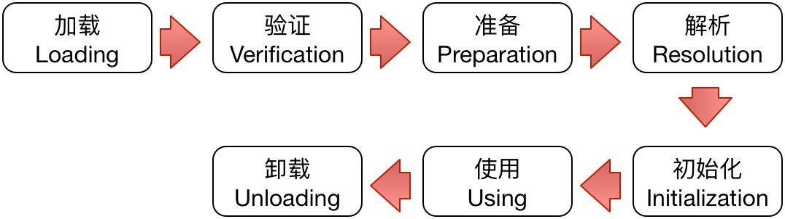
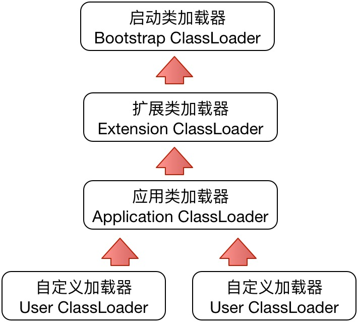
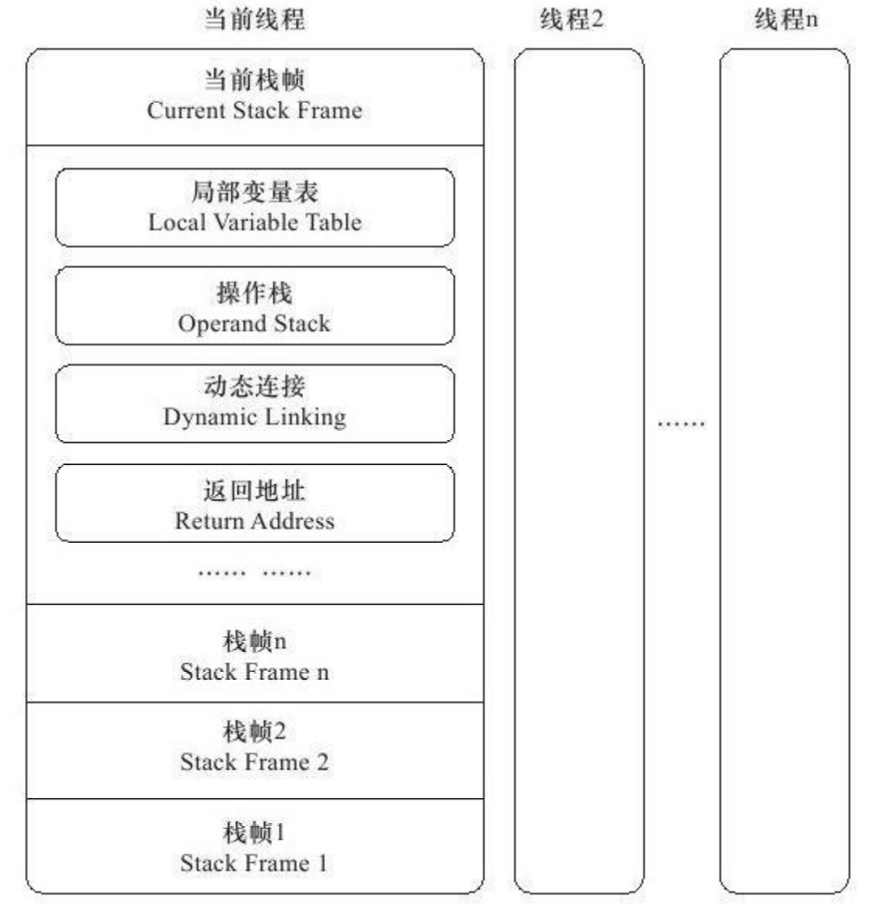
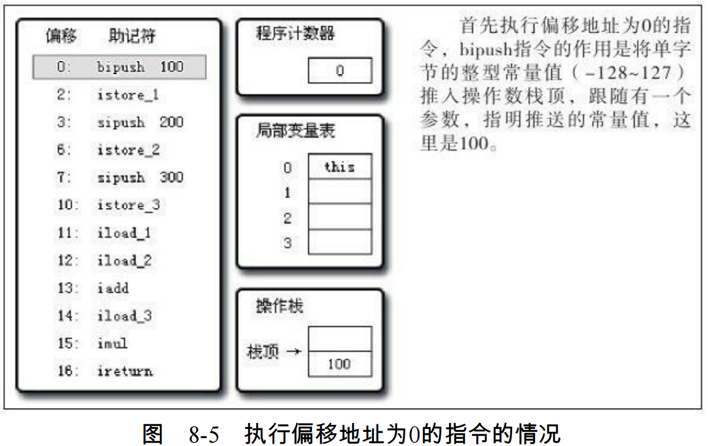
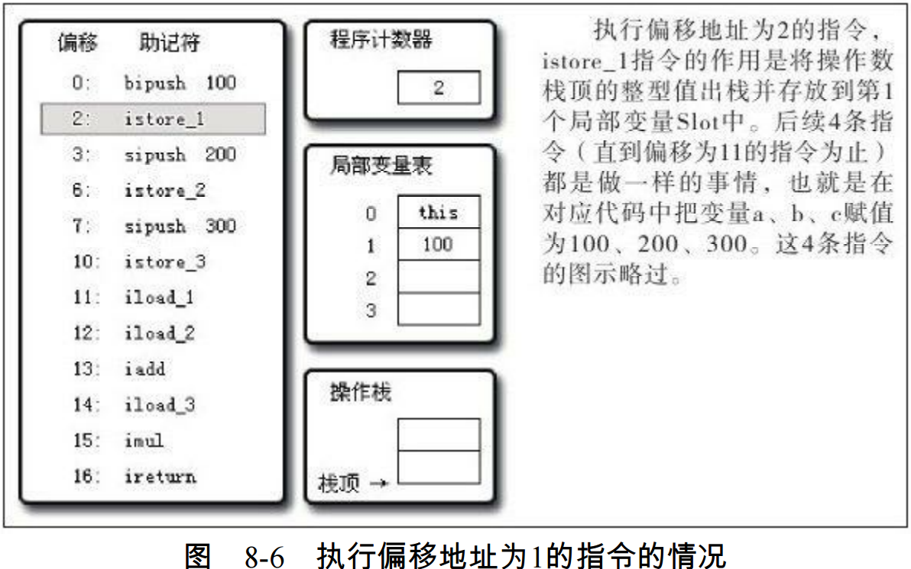
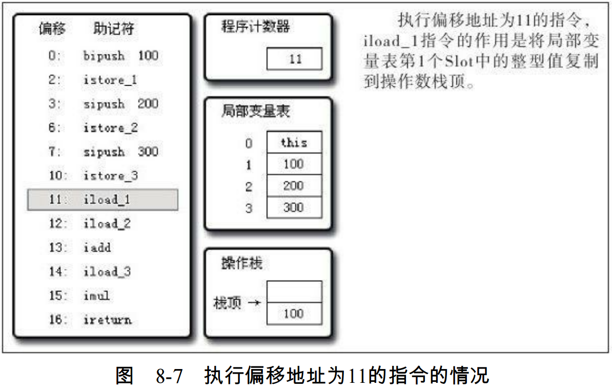
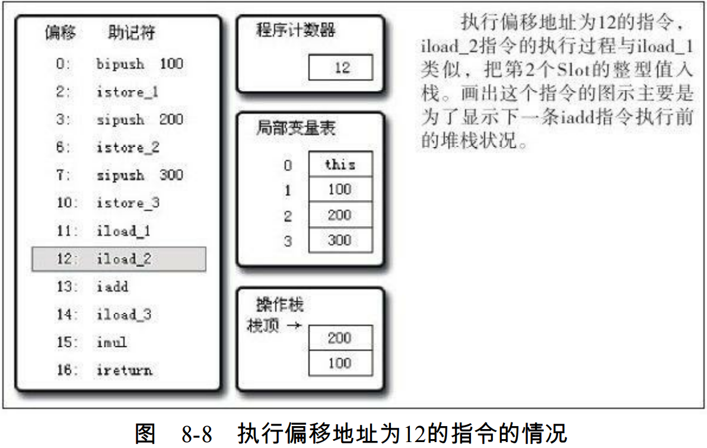
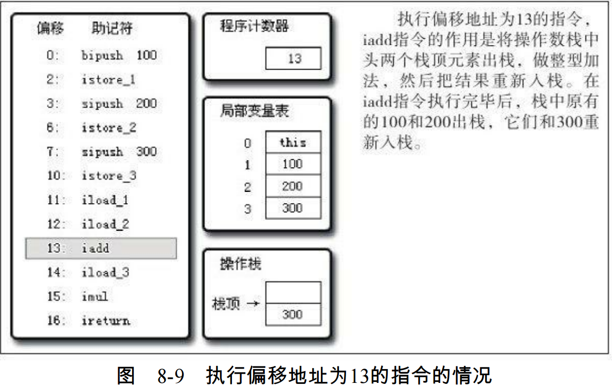
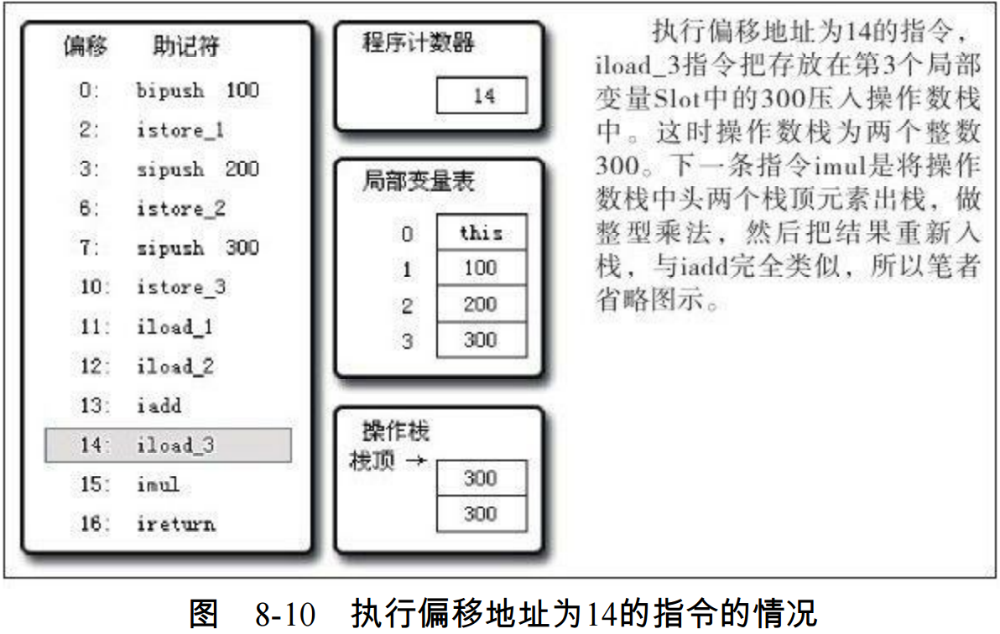
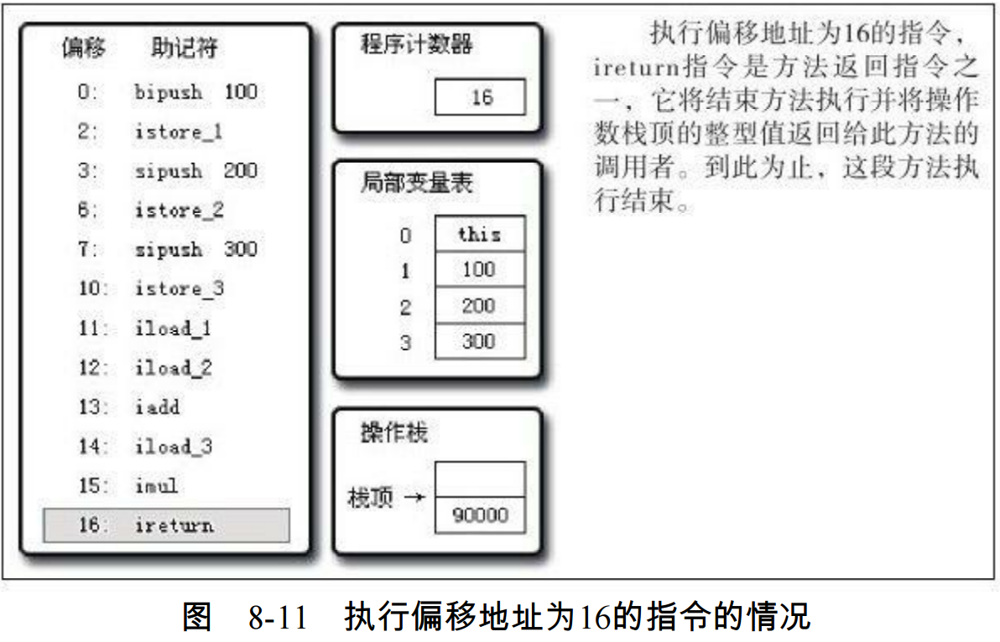

# 第六章

# 第七章 虚拟机类加载机制
## 写在前面的话
1. 虚拟机如何加载class文件？
2. class文件中的信息进入到虚拟机后会发生什么变化？

## 7.1 知识点
1. 把描述类的数据从class文件加载到内存，并对数据进行校验、转换解析和初始化，最终形成可以被虚拟机
   直接使用的java类型，这就是`虚拟机类加载机制`
2. java天生可以动态扩展的语言特性就是依赖运行期间动态加载和动态连接这个特点实现的

## 7.2 类加载的时机（什么时候需要进行类的加载）
下图为类的生命周期：



JAVA虚拟机规范没有强制约束，由虚拟机具体实现自由把握。但是对于初始化阶段，规范严格要求`有且只有5种情况`
必须立即对类进行『初始化』(而加载、验证、准备自然需要在此之前)
1. 遇到new(使用new关键字实例化对象)、getstatic(读取静态字段`被final修饰、已在编译期把结果放入常量池的除外`)、
   putstatic(设置静态字段`被final修饰、已在编译期把结果放入常量池的除外`)或invokestatic(调用类的静态方法)
   这4条字节码指令时，如果类没有进行过初始化，则先触发初始化
2. 使用java.lang.reflect包的方法对类进行反射调用的时候，如果类没有进行过初始化，则先触发初始化
3. 当初始化一个类的时候，如果发现其父类还没有进行过初始化，则先触发其父类初始化
4. 当虚拟机启动时，用户需要指定一个要执行的主类(包含main()方法的类)，需要先初始化这个主类
5. 使用JDK1.7的动态语言支持时，如果一个java.lang.invoke.MethodHandle实例最后的解析结果是REF_getStatic、
   REF_putStatic、REF_invokeStatic的方法句柄，并且这个方法句柄所对应的类没有进行过初始化，则先触发初始化

以上5种场景中的行为称为对一个类进行`主动引用`，除此之外，所有引用类的方式都不会触发初始化，称为`被动引用`

被动引用例子1：通过子类引用父类的静态字段，不会导致子类初始化
```java
package org.fenixsoft.classloading;
public class SuperClass {
    static {
        System.out.println("SuperClass init!");
    }
    public static int value = 123;
}
public class SubClass extends SuperClass{
    static {
        System.out.println("SubClass init!");
    }
}
public class static void main(String[] args) {
    System.out.println(SubClass.value);
}
输出：SuperClass init!
```
被动引用例子2：通过数组定义引用类不会触发此类的初始化
```java
public class static void main(String[] args) {
    SuperClass[] sca = new SuperClass[10];
}
没有输出 //虚拟机会触发一个[Lorg.fenixsoft.classloading.SuperClass](虚拟机自动生成)的类初始化阶段
```
被动引用例子2：常量再编译阶段会存入调用类的常量池中，本质上并没有直接引用到定义常量的类，因此不会触发定义常量的类的初始化
```java
package org.fenixsoft.classloading;
public class ConstClass {
    static {
        System.out.println("ConstClass init!");
    }
    public static final int value = 123;
}
public class static void main(String[] args) {
    System.out.println(ConstClass.value);
}
没有输出
```

## 7.3 类加载的过程

### 7.3.1 加载
加载需要完成以下3个内容：
1. 通过一个类的全限定名来获取定义此类的二进制字节流
2. 将这个字节流所代表的静态存储结构转化为方法区的运行时数据结构
3. 再内存中生成一个代表这个类的java.lang.Class对象，作为方法区这个类的各种数据的访问入口

一个非数组类的加载阶段是开发人员可控性最强的，开发人员可以自定义直接的类加载器去控制字节流的获取方式(重写一个类加载器的loadClass()方法)

对数组而言，本身不通过类加载器创建给，由java虚拟机直接创建，但是数组类的元素类型最终是要靠类加载器去创建

### 7.3.2 验证
是连接的第一步，主要目的是为了确保Class文件的字节流中包含的信息符合当前虚拟机的要求，并且不会危害虚拟机自身的安全

大致氛围一下4个阶段检验动作：
1. 文件格式验证：通过这个阶段后，字节流才会进入内存的方法区中进行存储，所有后面的3个验证都是基于方法区的存储结构进行的，不会操作字节流

   验证字节流是否符合Class文件格式的规范，并且能被当前版本的虚拟机处理
2. 元数据验证：主要目的是对`类的元数据`进行语义校验，保证不存在不符合Java语言规范的元数据信息
3. 字节码验证：主要目的通过数据流和控制流分析，确认程序语义是合法的、符合逻辑的，这个阶段将对`类的方法`体进行校验分析
4. 符号引用验证：主要目的是确保解析动作能正常执行，如果无法通过符合引用验证，那没将会抛出java.lang.IncompatibleClassChangeError异常，
   如IllegalAccessError,NoSuchFieldError,NoSuchMethodError等
   `发生再解析阶段中`

   `可以考虑使用-Xverify:none参数来关闭大部分的类验证措施，以缩短虚拟机加载的时间`

### 7.3.3 准备
正式未类变量分配内存并设置类变量`初始值`的阶段，这些变量锁使用的内存都将再方法区中进行分配，
`这里分配内存的仅包括类变量(被static修饰的变量)`，而不包括实例变量，实例变量将会再对象实例化时随着对象一起分配再Java堆中。

初始值通常情况指数据类型的零值，如static int value=123;指0二不是123,这是因为此尚未执行任何方法，而value=123的putstatic指令是放在类构造器
clinit()方法中的，它将再初始化阶段执行；特殊情况下如字段属性表存在ConstantValue属性，static final int value =123，编译时会将value生成
生成ConstantValue属性，再准备阶段虚拟机会根据ConstantValue属将value赋值为123
### 7.3.4 解析
将常量池内的符号引用替换为直接引用的过程
- 符号引用(Symbolic References)：以一组符号来描述所引用的目标，符号可以是任何形式的字面量，只要使用时能无歧义地定位到目标即可。符号引用与虚拟机实现
  的内存布局无关，引用的目标并不一定已经加载到内存中。各种虚拟机实现的内存布局个不相同，但是他们能接受的符号引用必须都是一致的，因为符号引用的字面量形式
  明确定义在Java虚拟机规范的Class文件中的
- 直接引用(Direct References)：可以是直接指向目标的指针、相对偏移量或是一个能间接定位到目标的句柄。直接引用是和虚拟机实现的内存布局相关的，同一个符号
  引用在不同的虚拟机实例上翻译出来的直接引用一般不会相同。

虚拟机并未规定解析阶段发生的具体时间，只要求再执行anewarray、checkcast、getfield、getstatic、instanceof、invokedynamic、invokeinterface、
invokespecial、invokestatic、invokevirtual、idc、idc_w、multianewarray、new、putfield和putstatic这16个用于操作符号引用的字节码命令之前，先
对它们所使用的符号引用进行解析

解析动作主要针对类或接口、字段、类方法、接口方法、方法类型、方法句柄和调用点限定符

### 7.3.5 初始化

类加载的最后一个阶段；真正开始执行类中定义的java程序代码(或者说是字节码)；

在准备阶段，变量已经赋过一次系统要求的初始值，而在初始化阶段，则根据程序员通过程序制定的主官计划去初始化变量和其他资源

初始化阶段是执行类构造器clinit()方法的过程
1. clinit()方法由编译器自动收集类中的所有类变量的赋值动作和静态语句块(static{}块)中的语句合并产生的，编译器收集的顺序是由语句在源文件中出现的
   顺序所决定的，静态语句块中只能访问到定义再静态语句块之前的变量，定义再它后面的变量，在前面的静态语句块可以赋值，但是不能访问
2. clinit()方法与类的构造函数(实例构造器init()方法)不同，它不需要显示的调用父类构造器，虚拟机会保证在子类的clinit()方法执行之前，父类的
   clinit()方法已经执行完毕。因此虚拟机中第一个被执行的clinit()方法的类肯定是java.lang.Object
3. 由于父类clinit()方法先执行，因此父类中定义的静态语句块要优先子类的变量赋值操作
4. clinit()方法对于类或接口并不是必需的，如果一个类中没有静态语句块，也没有对变量的赋值操作，那没编译器可以不为类生成clinit()方法
5.
6. 虚拟机会保证一个类的clinit()方法再多线程环境中被正确的加锁、同步，如果多个线程同时去初始化一个类，只有一个线程去执行类的clinit()方法，其他
   线程需要租塞等待，直到活动线程执行clinit()方法完毕，如果在一个类的clinit()方法中有耗时长的操作，可能造成多个线程租塞

## 7.4 类加载器

类加载器阶段中的『通过一个类的全限定名来获取描述此类的二进制字节流』这个动作放到java虚拟机外部去实现，以便让应用程序自己去决定如何去获取需要的类。
实现这个动作的代码模块称为『类加载器』

在类层次划分、OSGi、热部署、代码加密中使用广泛

对于任意一个类，都需要由加载它的类加载器和这个类本身一同确立其在java虚拟机中的唯一性，每一个类加载器，都拥有一个独立的类名称空间。比较两个类是否相等
（Class对象的equals方法isAssignableForm,isInstance方法返回的结果和instanceof判断），只有在这两个类都使用相同的类加载器加载的情况下，否则即使
是同一个Class类文件，也不相等

### 7.4.1 双亲委派模型

Java虚拟机角度2种不同的加载器

`启动类加载器(Bootstrap ClassLoader)`：使用C++语言实现，虚拟机自身的一部分

`其他的类加载器`：Java语言实现，独立于虚拟机的外部，并且全部继承自抽象类java.lang.ClassLoader

Java开发人员角度的3中加载器：

`启动类加载器(Bootstrap ClassLoader)`:负责加载JAVA_HOME\lib目录中或被-Xbootclasspath参数指定的路径中的类，是虚拟机识别的，无法被Java程序引用

`扩展类加载器(Extension ClassLoader)`:sum.misc.Launcher$ExtClassLoader实现，加载JAVA_HOME\lib\ext目录或java.ext.dirs系统变量所指定的路径
  中的所有类库

`应用类加载器(Application ClassLoader)`: sum.misc.Launcher$AppClassLoader实现，负责加载用户类路径classpath上所指定的类库，开发者直接使用这个



如上为类加载器双亲委派模型，要求除顶层启动类外，其余加载器都应当有直接的父类加载器，父子关系一般不会以继承关系实现，而是以组合关系服用父类加载器代码

类加载器双亲委派模型过程：如果一个类加载器收到了类的加载请求，它首先不会自己尝试去加载这个类，而是把这个请求委派给父类加载器去完成，每一个层次的类加载器
都是如此，因此所有的加载请求最终都应该传送到顶层的启动类加载器中，只有当父类加载器反馈自己无法完成这个加载请求(它的搜索范围中没有找到所需的类)时，子加
载器才会尝试自己去加载

# 第八章 虚拟机字节码执行引擎
虚拟机是相对于物理机的概念，两种机器都有代码执行能力，其区别是物理机的执行引擎是直接建立在处理器、硬件、指令集和操作系统层面上，而虚拟机的执行引擎是由自己实现，
因此可以自行定制指令集和执行引擎的结构体系，并且能够执行那些不被硬件直接支持的指令集格式。

在Java虚拟机规范中制定了虚拟机字节码执行引擎的概念模型，这个概念模型成为各种虚拟机执行引擎的统一外观（Facade）。在不同的虚拟机实现里面，执行引擎在执行Java代
码的时候可能会有解释执行（通过解释器执行）和编译执行（通过即时编译器产生本地代码执行）两种选择，也可能两者兼备

## 8.2 运行时栈帧结构
栈帧（Stack Frame）是用于支持虚拟机进行方法调用和方法执行的数据结构，它是虚拟
机运行时数据区中的虚拟机栈（Virtual Machine Stack）的栈元素。栈帧存储了方法的局部
变量表、操作数栈、动态连接和方法返回地址等信息。每一个方法从调用开始至执行完成的
过程，都对应着一个栈帧在虚拟机栈里面从入栈到出栈的过程。

每一个栈帧都包括了局部变量表、操作数栈、动态连接、方法返回地址和一些额外的附
加信息。在编译程序代码的时候，栈帧中需要多大的局部变量表，多深的操作数栈都已经完
全确定了，并且写入到方法表的Code属性之中，因此一个栈帧需要分配多少内存，不会受
到程序运行期变量数据的影响，而仅仅取决于具体的虚拟机实现



### 8.2.1 局部变量表
局部变量表（Local Variable Table）是一组变量值存储空间，用于存放方法参数和方法
内部定义的局部变量。在Java程序编译为Class文件时，就在方法的Code属性的max_locals数
据项中确定了该方法所需要分配的局部变量表的最大容量

局部变量表的容量以变量槽（Variable Slot，下称Slot）为最小单位，虚拟机规范中并没
有明确指明一个Slot应占用的内存空间大小，只是很有导向性地说到每个Slot都应该能存放一
个boolean、byte、char、short、int、float、reference或returnAddress类型的数据

reference类型表示对一个对象实例的引用，一是从此引用中直接或间接地查找到对象在Java
堆中的数据存放的起始地址索引，二是此引用中直接或间接地查找到对象所属数据类型在方法区中的存储的类型信息

虚拟机通过索引定位的方式使用局部变量表，索引值的范围是从0开始至局部变量表最
大的Slot数量。如果访问的是32位数据类型的变量，索引n就代表了使用第n个Slot，如果是64
位数据类型的变量，则说明会同时使用n和n+1两个Slot。

关于局部变量表，还有一点可能会对实际开发产生影响，就是局部变量不像前面介绍的
类变量那样存在“准备阶段”，即使在初始化阶段程序员没有为类变量赋值也没有关系，类变量仍然具有一个确
定的初始值。但局部变量就不一样，如果一个局部变量定义了但没有赋初始值是不能使用的，不要认为Java中任何情况下都存在诸如整型变量默认为0，

### 8.2.2 操作数栈
操作数栈（Operand Stack）也常称为操作栈，它是一个后入先出（Last In First
Out,LIFO）栈。同局部变量表一样，操作数栈的最大深度也在编译的时候写入到Code属性的
max_stacks数据项中。

### 8.2.3 动态连接
每个栈帧都包含一个指向运行时常量池中该栈帧所属方法的引用，持有这个引用是为
了支持方法调用过程中的动态连接（Dynamic Linking）

### 8.2.4 方法返回地址、附加信息
当一个方法开始执行后，只有两种方式可以退出这个方法。第一种方式是执行引擎遇到
任意一个方法返回的字节码指令，这时候可能会有返回值传递给上层的方法调用者（调用当
前方法的方法称为调用者），是否有返回值和返回值的类型将根据遇到何种方法返回指令来
决定，这种退出方法的方式称为正常完成出口（Normal Method Invocation Completion）。
另外一种退出方式是，在方法执行过程中遇到了异常，并且这个异常没有在方法体内得到处理，无论是Java虚拟机内部产生的异常

## 8.3 方法调用（选择调用方法的过程，非执行）
方法调用并不等同于方法执行，方法调用阶段唯一的任务就是确定被调用方法的版本
（即调用哪一个方法），暂时还不涉及方法内部的具体运行过程。

### 8.3.1 解析
调用目标在程序代码写好、编译器进行编译时就必须确定下来。这类方法的调用称为解析（Resolution）。

在Java语言中符合“编译期可知，运行期不可变”这个要求的方法，主要包括静态方法和
私有方法两大类，前者与类型直接关联，后者在外部不可被访问，这两种方法各自的特点决
定了它们都不可能通过继承或别的方式重写其他版本，因此它们都适合在类加载阶段进行解析。

与之相对应的是，在Java虚拟机里面提供了5条方法调用字节码指令，分别如下。

1. invokestatic：调用静态方法。
2. invokespecial：调用实例构造器＜init＞方法、私有方法和父类方法。
3. invokevirtual：调用所有的虚方法。
4. invokeinterface：调用接口方法，会在运行时再确定一个实现此接口的对象。
5. invokedynamic：先在运行时动态解析出调用点限定符所引用的方法，然后再执行该方
法，在此之前的4条调用指令，分派逻辑是固化在Java虚拟机内部的，而invokedynamic指令
的分派逻辑是由用户所设定的引导方法决定的

只要能被invokestatic和invokespecial指令调用的方法，都可以在解析阶段中确定唯一的
调用版本，符合这个条件的有静态方法、私有方法、实例构造器、父类方法4类，它们在类
加载的时候就会把符号引用解析为该方法的直接引用。这些方法可以称为非虚方法，与之相
反，其他方法称为虚方法（除去final方法，后文会提到）

Java中的非虚方法除了使用invokestatic、invokespecial调用的方法之外还有一种，就是被
final修饰的方法

解析调用一定是个静态的过程，在编译期间就完全确定，在类装载的解析阶段就会把涉
及的符号引用全部转变为可确定的直接引用，不会延迟到运行期再去完成。而分派
（Dispatch）调用则可能是静态的也可能是动态的，根据分派依据的宗量数可分为单分派和
多分派。这两类分派方式的两两组合就构成了静态单分派、静态多分派、动态单分派、动态
多分派4种分派组合情况

### 8.3.2 分派
Java是一门面向对象的程序语言，因为Java具备面向对象的3个基本特征：继
承、封装和多态。本节讲解的分派调用过程将会揭示多态性特征的一些最基本的体现，
如“重载”和“重写”在Java虚拟机之中是如何实现的，这里的实现当然不是语法上该如何写，
我们关心的依然是虚拟机如何确定正确的目标方法

###### 静态分派
所有依赖静态类型来定位方法执行版本的分派动作称为静态分派。静态分派的典型应用
是方法重载。静态分派发生在编译阶段，因此确定静态分派的动作实际上不是由虚拟机来执
行的

`编译期间选择静态分派目标的过程，这个过程也是Java语言实现方法重载的本质，重载方法的选择再编译期就决定了`

```java
public class StaticDispatch{
static abstract class Human{}
static class Man extends Human{}
static class Woman extends Human{}
public void sayHello（Human guy）{
    System.out.println（"hello,guy！"）；
}
public void sayHello（Man guy）{
    System.out.println（"hello,gentleman！"）；
}
public void sayHello（Woman guy）{
    System.out.println（"hello,lady！"）；
}
public static void main（String[]args）{
    Human man=new Man（）；
    Human woman=new Woman（）；
    StaticDispatch sr=new StaticDispatch（）；
    sr.sayHello（man）；
    sr.sayHello（woman）；
}

结果：
hello,guy！
hello,guy！
```

“Human”称为变量的静态类型（Static Type），或者叫做的外观类型
（Apparent Type），后面的“Man”则称为变量的实际类型（Actual Type），静态类型的变化仅仅在使用时发生，变量本身的
静态类型不会被改变，并且最终的静态类型是在编译期可知的。实际类型变化的结果在运行期才可确定，编译器在编译程序的时候并不知道一个对象的实际类型是什么

main（）里面的两次sayHello（）方法调用，在方法接收者已经确定是对象“sr”的前提下，使用哪个重载版本，就
完全取决于传入参数的数量和数据类型。代码中刻意地定义了两个静态类型相同但实际类型
不同的变量，但虚拟机（准确地说是编译器）在重载时是通过参数的静态类型而不是实际类
型作为判定依据的。并且静态类型是编译期可知的，因此，在编译阶段，Javac编译器会根
据参数的静态类型决定使用哪个重载版本，所以选择了sayHello（Human）作为调用目标，
并把这个方法的符号引用写到main（）方法里的两条invokevirtual指令的参数中

解析与分派这两者之间的关系并不是
二选一的排他关系，它们是在不同层次上去筛选、确定目标方法的过程。例如，前面说过，
静态方法会在类加载期就进行解析，而静态方法显然也是可以拥有重载版本的，选择重载版
本的过程也是通过静态分派完成的

###### 动态分派
动态分派的过程，它和多态性的另外一个重要体现——重写（Override）

```java
static abstract class Human{
    protected abstract void sayHello（）；
}
static class Man extends Human{
    @Override
    protected void sayHello（）{
        System.out.println（"man say hello"）；
    }
}
static class Woman extends Human{
    @Override
    protected void sayHello（）{
        System.out.println（"woman say hello"）；
    }
}
public static void main（String[]args）{
    Human man=new Man（）；
    Human woman=new Woman（）；
    man.sayHello（）；
    woman.sayHello（）；
    man=new Woman（）；
    man.sayHello（）；
}
结果：
man say hello
woman say hello
woman say hello
```
Human.sayHello（）的符号引用）完全一样的，但是这两句指令最终执行的目标方法并不相
同。原因就需要从invokevirtual指令的多态查找过程开始说起，invokevirtual指令的运行时解
析过程大致分为以下几个步骤：
1. 找到操作数栈顶的第一个元素所指向的对象的实际类型，记作C。
2. 如果在类型C中找到与常量中的描述符和简单名称都相符的方法，则进行访问权限校
验，如果通过则返回这个方法的直接引用，查找过程结束；如果不通过，则返回java.lang.IllegalAccessError异常。
3. 否则，按照继承关系从下往上依次对C的各个父类进行第2步的搜索和验证过程。
4. 如果始终没有找到合适的方法，则抛出java.lang.AbstractMethodError异常

由于invokevirtual指令执行的第一步就是在运行期确定接收者的实际类型，所以两次调
用中的invokevirtual指令把常量池中的类方法符号引用解析到了不同的直接引用上，这个过
程就是Java语言中方法重写的本质。我们把这种在运行期根据实际类型确定方法执行版本的分派过程称为动态分派

###### 单分派与多分派
方法的接收者与方法的参数统称为方法的宗量，根据分派基于多少种宗量，可以将分派划分为单分派和多分派两种。单分派是根
据一个宗量对目标方法进行选择，多分派则是根据多于一个宗量对目标方法进行选择。

### 8.3.3 动态语言的支持
动态类型语言的关键特征是它的类型检查的主体过程是在运行期而不是编译期

###### java.lang.invoke包
主要目的是在之前单纯依靠符号引用来确定调用的目标方法这种方式以外，提供一
种新的动态确定目标方法的机制，称为MethodHandle（类似C/C++中的Function Pointer，或者C#里面的Delegate类）
```java
static class ClassA{
    public void println（String s）{
        System.out.println（s）；
    }
}
public static void main（String[]args）throws Throwable{
    Object obj=System.currentTimeMillis（）%2==0?System.out：new ClassA（）；
    /*无论obj最终是哪个实现类，下面这句都能正确调用到println方法
    getPrintlnMH（obj）.invokeExact（"icyfenix"）；
}
private static MethodHandle getPrintlnMH（Object reveiver）throws Throwable{
    /*MethodType：代表“方法类型”，包含了方法的返回值（methodType（）的第一个参数）和具体参数（methodType（）第二个及以后的参数）*/
    MethodType mt=MethodType.methodType（void.class,String.class）；
    /*lookup（）方法来自于MethodHandles.lookup，这句的作用是在指定类中查找符合给定的方法名称、方法类型，并且符合调用权限的方法句柄*/
    /*因为这里调用的是一个虚方法，按照Java语言的规则，方法第一个参数是隐式的，代表该方法的接收者，也即是this指向的对象，
    这个参数以前是放在参数列表中进行传递的，而现在提供了bindTo（）方法来完成这件事情*/
    retturn lookup（）.findVirtual（reveiver.getClass（），"println"，mt）.bindTo（reveiver）；
}
```

`MethodHandle与Reflection区别`
1. 从本质上讲，Reflection和MethodHandle机制都是在模拟方法调用，但Reflection是在模拟
Java代码层次的方法调用，而MethodHandle是在模拟字节码层次的方法调用。在
MethodHandles.lookup中的3个方法——findStatic（）、findVirtual（）、findSpecial（）正是
为了对应于invokestatic、invokevirtual＆invokeinterface和invokespecial这几条字节码指令的执
行权限校验行为，而这些底层细节在使用Reflection API时是不需要关心的。
2. Reflection中的java.lang.reflect.Method对象远比MethodHandle机制中的
java.lang.invoke.MethodHandle对象所包含的信息多。前者是方法在Java一端的全面映像，包
含了方法的签名、描述符以及方法属性表中各种属性的Java端表示方式，还包含执行权限等
的运行期信息。而后者仅仅包含与执行该方法相关的信息。用通俗的话来讲，Reflection是重
量级，而MethodHandle是轻量级。
3. 由于MethodHandle是对字节码的方法指令调用的模拟，所以理论上虚拟机在这方面做的
各种优化（如方法内联），在MethodHandle上也应当可以采用类似思路去支持（但目前实现
还不完善）。而通过反射去调用方法则不行

Reflection API的设计目标是只为Java语言服务的，而MethodHandle则设计成可服务于所有Java虚拟机之上的语言

###### invokedynamic指令
在某种程度上，invokedynamic指令与MethodHandle机制的作用是一样的，可以把它们想象成为了达成同一个目的，一个采用上
层Java代码和API来实现，另一个用字节码和Class中其他属性、常量来完成。

## 8.4 基于栈的字节码解释执行引擎

### 8.4.2 基于栈的指令集与基于寄存器的指令集
基于栈的指令集主要的优点就是可移植，寄存器由硬件直接提供，程序直接依赖这些
硬件寄存器则不可避免地要受到硬件的约束。

栈架构指令集的主要缺点是执行速度相对来说会稍慢一些

### 8.4.3 基于栈的解释器执行过程
以下的执行过程仅仅是一种概念模型，虚拟机最终会对执行过程做一些优化来提高性
能，实际的运作过程不一定完全符合概念模型的描述……更准确地说，实际情况会和上面描
述的概念模型差距非常大
















#第九章 类加载及执行子系统的案例与实践


