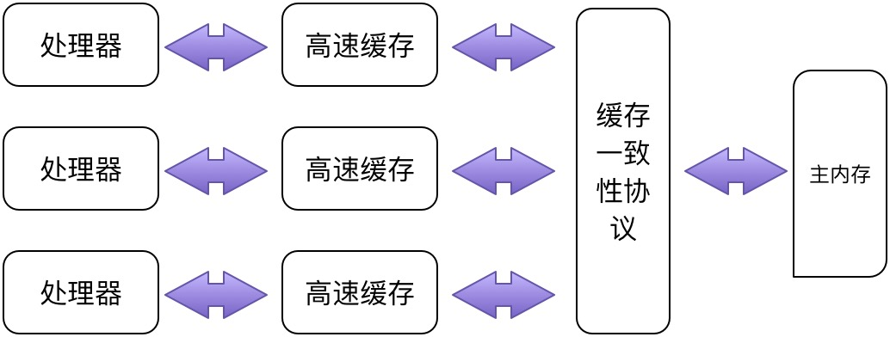
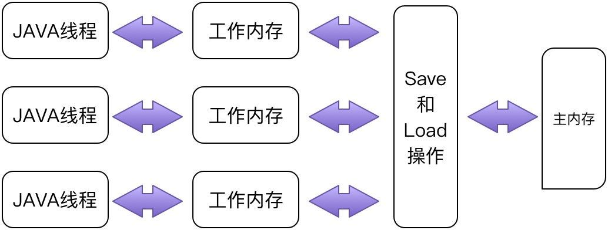
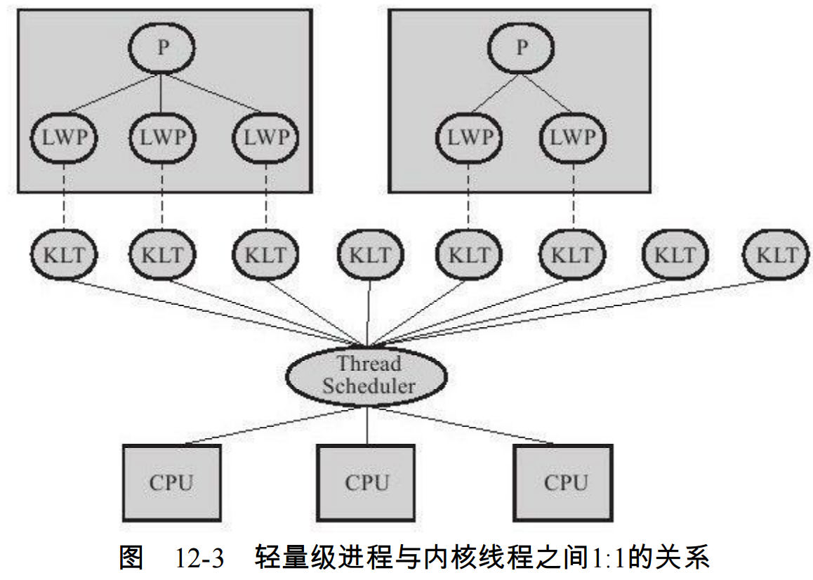
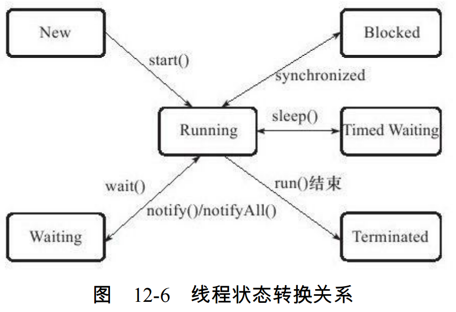
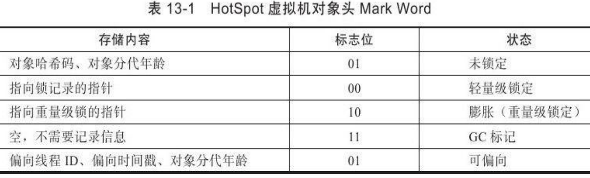
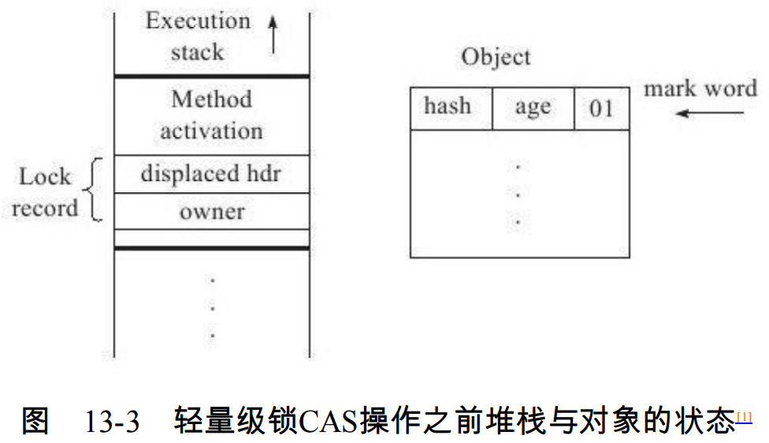
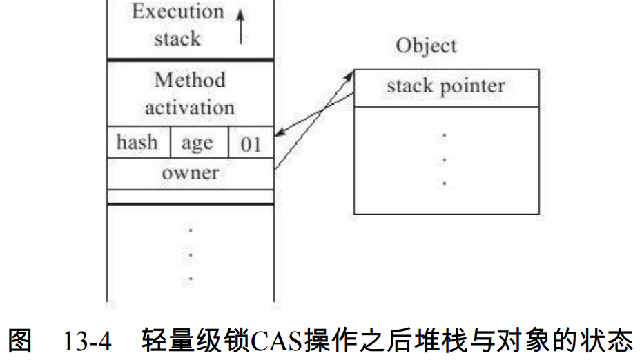
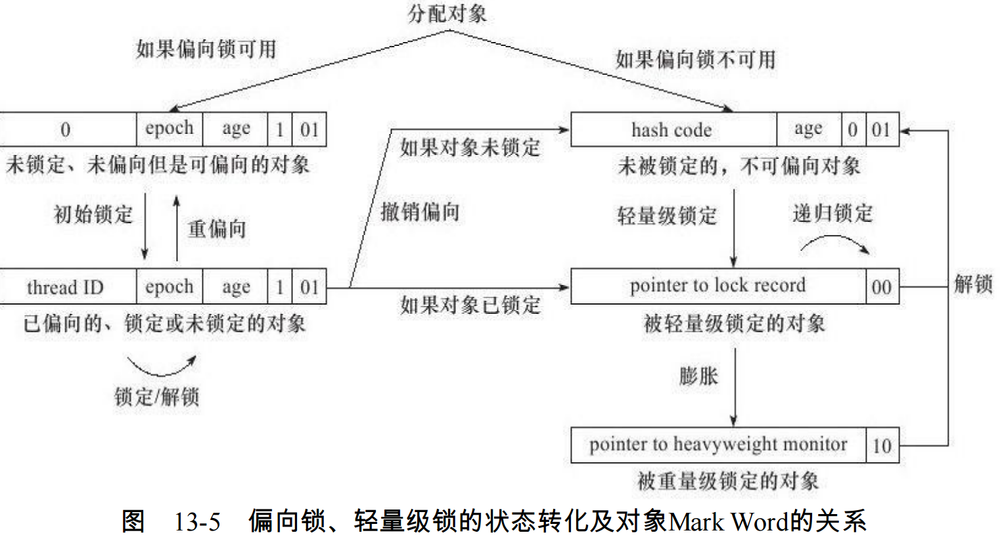

# 第12章 Java内存模型与线程

衡量一个服务性能的高低好坏，每秒事务处理数（Transactions
Per Second,TPS）是最重要的指标之一，它代表着一秒内服务端平均能响应的请求总数，而
TPS值与程序的并发能力又有非常密切的关系

### 12.2 硬件的效率与一致性
由于计算机的存储设备与处理器的运算速度有几个数量级的差距，
所以现代计算机系统都不得不加入一层读写速度尽可能接近处理器运算速度的高速缓存
（Cache）来作为内存与处理器之间的缓冲：将运算需要使用到的数据复制到缓存中，让运
算能快速进行，当运算结束后再从缓存同步回内存之中，这样处理器就无须等待缓慢的内存读写了



基于高速缓存的存储交互很好地解决了处理器与内存的速度矛盾，但是也为计算机系统
带来更高的复杂度，因为它引入了一个新的问题：缓存一致性（Cache Coherence）。

在本章中将会多次提到的“内存模型”一词，可以理解为`在特定的操作协
议下，对特定的内存或高速缓存进行读写访问的过程抽象`。不同架构的物理机器可以拥有不
一样的内存模型，而Java虚拟机也有自己的内存模型，并且这里介绍的内存访问操作与硬件的缓存访问操作具有很高的可比性

除了增加高速缓存之外，为了使得处理器内部的运算单元能尽量被充分利用，处理器可
能会对输入代码进行乱序执行（Out-Of-Order Execution）优化，处理器会在计算之后将乱序
执行的结果重组，保证该结果与顺序执行的结果是一致的，但并不保证程序中各个语句计算
的先后顺序与输入代码中的顺序一致，因此，如果存在一个计算任务依赖另外一个计算任务
的中间结果，那么其顺序性并不能靠代码的先后顺序来保证。与处理器的乱序执行优化类
似，Java虚拟机的即时编译器中也有类似的指令重排序（Instruction Reorder）优化。

### 12.3 JAVA内存模型

Java虚拟机规范中试图定义一种Java内存模型[1]（Java Memory Model,JMM）来屏蔽掉各
种硬件和操作系统的内存访问差异，以实现让Java程序在各种平台下都能达到一致的内存访问效果

#### 12.3.1 主内存与工作内存

Java内存模型的主要目标是定义程序中各个变量的访问规则，即在虚拟机中将变量存储
到内存和从内存中取出变量这样的底层细节。`此处的变量（Variables）与Java编程中所说的
变量有所区别，它包括了实例字段、静态字段和构成数组对象的元素，但不包括局部变量与
方法参数，因为后者是线程私有的，不会被共享，自然就不会存在竞争问题`。为了获得较
好的执行效能，Java内存模型并没有限制执行引擎使用处理器的特定寄存器或缓存来和主内
存进行交互，也没有限制即时编译器进行调整代码执行顺序这类优化措施

Java内存模型规定了所有的变量都存储在主内存（Main Memory）中（此处的主内存与
介绍物理硬件时的主内存名字一样，两者也可以互相类比，但此处仅是虚拟机内存的一部
分）。每条线程还有自己的工作内存（Working Memory，可与前面讲的处理器高速缓存类
比），线程的工作内存中保存了被该线程使用到的变量的主内存副本拷贝，线程对变量的
所有操作（读取、赋值等）都必须在工作内存中进行，而不能直接读写主内存中的变量。
不同的线程之间也无法直接访问对方工作内存中的变量，线程间变量值的传递均需要通过主内存来完成



#### 12.3.2 内存间交互操作
关于主内存与工作内存之间具体的交互协议，即一个变量如何从主内存拷贝到工作内
存、如何从工作内存同步回主内存之类的实现细节，Java内存模型中定义了以下8种操作来
完成，虚拟机实现时必须保证下面提及的每一种操作都是原子的、不可再分的（对于double
和long类型的变量来说，load、store、read和write操作在某些平台上允许有例外

- lock（锁定）：作用于主内存的变量，它把一个变量标识为一条线程独占的状态。
- unlock（解锁）：作用于主内存的变量，它把一个处于锁定状态的变量释放出来，释放后的变量才可以被其他线程锁定。
- read（读取）：作用于主内存的变量，它把一个变量的值从主内存传输到线程的工作内存中，以便随后的load动作使用。
- load（载入）：作用于工作内存的变量，它把read操作从主内存中得到的变量值放入工作内存的变量副本中。
- use（使用）：作用于工作内存的变量，它把工作内存中一个变量的值传递给执行引擎，每当虚拟机遇到一个需要使用到变量的值的字节码指令时将会执行这个操作。
- assign（赋值）：作用于工作内存的变量，它把一个从执行引擎接收到的值赋给工作内存的变量，每当虚拟机遇到一个给变量赋值的字节码指令时执行这个操作。
- store（存储）：作用于工作内存的变量，它把工作内存中一个变量的值传送到主内存中，以便随后的write操作使用。
- write（写入）：作用于主内存的变量，它把store操作从工作内存中得到的变量的值放入主内存的变量中。

Java内存模型只要求上述两个操作必须按顺序执行，而没有保证是连续执行。也就是说，read与load之间、store与write之间是可插入其他指令的

Java内存模型还规定了在执行上述8种基本操作时必须满足如下规则：

- 不允许read和load、store和write操作之一单独出现，即不允许一个变量从主内存读取了
但工作内存不接受，或者从工作内存发起回写了但主内存不接受的情况出现。
- 不允许一个线程丢弃它的最近的assign操作，即变量在工作内存中改变了之后必须把该变化同步回主内存。
- 不允许一个线程无原因地（没有发生过任何assign操作）把数据从线程的工作内存同步回主内存中。
- 一个新的变量只能在主内存中“诞生”，不允许在工作内存中直接使用一个未被初始化
（load或assign）的变量，换句话说，就是对一个变量实施use、store操作之前，必须先执行过了assign和load操作。
- 一个变量在同一个时刻只允许一条线程对其进行lock操作，但lock操作可以被同一条线
程重复执行多次，多次执行lock后，只有执行相同次数的unlock操作，变量才会被解锁。
- 如果对一个变量执行lock操作，那将会清空工作内存中此变量的值，在执行引擎使用这
个变量前，需要重新执行load或assign操作初始化变量的值。
- 如果一个变量事先没有被lock操作锁定，那就不允许对它执行unlock操作，也不允许去unlock一个被其他线程锁定住的变量。
- 对一个变量执行unlock操作之前，必须先把此变量同步回主内存中（执行store、write操作）

这8种内存访问操作以及上述规则限定，再加上稍后介绍的对volatile的一些特殊规定，
就已经完全确定了Java程序中哪些内存访问操作在并发下是安全的

#### 12.3.3 对于volatile型变量的特殊规则

###### 对所有线程的可见性
当一个变量定义为volatile之后，它将具备两种特性，第一是保证此变量对所有线程的可
见性，这里的“可见性”是指当一条线程修改了这个变量的值，新值对于其他线程来说是可以立即得知的。
`原理是在每次访问变量时都会进行一次刷新`

1. 对volatile变量执行写操作时，会在写操作后加入一条store屏障指令
1. 对volatile变量执行读操作时，会在读操作前加入一条load屏障指令

volatile变量在各个线程的工作内存中不存在一致性问题（在各个线程
的工作内存中，volatile变量也可以存在不一致的情况，但由于每次使用之前都要先刷新，执
行引擎看不到不一致的情况，因此可以认为不存在一致性问题），但是Java里面的运算并非
原子操作，导致volatile变量的运算在并发下一样是不安全的，我们可以通过一段简单的演示来说明原因

```
public class VolatileTest{
    public static volatile int race=0；
    public static void increase（）{
        race++；
    }
    private static final int THREADS_COUNT=20；
    public static void main（String[]args）{
        Thread[]threads=new Thread[THREADS_COUNT]；
        for（int i=0；i＜THREADS_COUNT；i++）{
            threads[i]=new Thread（new Runnable（）{
                @Override
                public void run（）{
                    for（int i=0；i＜10000；i++）{
                        increase（）；
                    }
                }
            }）；
            threads[i].start（）；
        }
        //等待所有累加线程都结束
        while（Thread.activeCount（）＞1）
        Thread.yield（）；
        System.out.println（race）；
    }
}

//每次运行程序，输出的结果都不一样，都是一个小于200000的数字
```

问题就出现在自增运算“race++”之中

由于volatile变量只能保证可见性，在不符合以下两条规则的运算场景中，我们仍然要通
过加锁（使用synchronized或java.util.concurrent中的原子类）来保证原子性。

- 运算结果并不依赖变量的当前值，或者能够确保只有单一的线程修改变量的值。
- 变量不需要与其他的状态变量共同参与不变约束。

###### 禁止指令重排序优化

假定T表示一个线程，V和W分别表示两个volatile型变量，那么在进行read、load、use、assign、
store和write操作时需要满足如下规则

只有当线程T对变量V执行的前一个动作是load的时候，线程T才能对变量V执行use动
作；并且，只有当线程T对变量V执行的后一个动作是use的时候，线程T才能对变量V执行
load动作。线程T对变量V的use动作可以认为是和线程T对变量V的load、read动作相关联，必
须连续一起出现（这条规则要求在工作内存中，每次使用V前都必须先从主内存刷新最新的
值，用于保证能看见其他线程对变量V所做的修改后的值）。

只有当线程T对变量V执行的前一个动作是assign的时候，线程T才能对变量V执行store动
作；并且，只有当线程T对变量V执行的后一个动作是store的时候，线程T才能对变量V执行
assign动作。线程T对变量V的assign动作可以认为是和线程T对变量V的store、write动作相关
联，必须连续一起出现（这条规则要求在工作内存中，每次修改V后都必须立刻同步回主内
存中，用于保证其他线程可以看到自己对变量V所做的修改）。

假定动作A是线程T对变量V实施的use或assign动作，假定动作F是和动作A相关联的load
或store动作，假定动作P是和动作F相应的对变量V的read或write动作；类似的，假定动作B是
线程T对变量W实施的use或assign动作，假定动作G是和动作B相关联的load或store动作，假
定动作Q是和动作G相应的对变量W的read或write动作。如果A先于B，那么P先于Q（这条规
则要求volatile修饰的变量不会被指令重排序优化，保证代码的执行顺序与程序的顺序相同）。

#### 12.3.4 对于long和double型变量的特殊规则
Java内存模型要求lock、unlock、read、load、assign、use、store、write这8个操作都具有
原子性，但是对于64位的数据类型（long和double），在模型中特别定义了一条相对宽松的
规定：允许虚拟机将没有被volatile修饰的64位数据的读写操作划分为两次32位的操作来进
行，即允许虚拟机实现选择可以不保证64位数据类型的load、store、read和write这4个操作的
原子性，这点就是所谓的long和double的非原子性协定（Nonatomic Treatment ofdouble andlong Variables）。
#### 12.3.5 原子性、可见性与有序性
Java内存模型是围绕着在并发过程中如何处理原子性、可见性和有序性这3个特征来建立的。

原子性（Atomicity）：由Java内存模型来直接保证的原子性变量操作包括read、load、
assign、use、store和write，我们大致可以认为基本数据类型的访问读写是具备原子性的（例
外就是long和double的非原子性协定，读者只要知道这件事情就可以了，无须太过在意这些
几乎不会发生的例外情况）。

可见性（Visibility）：可见性是指当一个线程修改了共享变量的值，其他线程能够立即
得知这个修改。上文在讲解volatile变量的时候我们已详细讨论过这一点。Java内存模型是通
过在变量修改后将新值同步回主内存，在变量读取前从主内存刷新变量值这种依赖主内存作
为传递媒介的方式来实现可见性的，无论是普通变量还是volatile变量都是如此，普通变量与
volatile变量的区别是，volatile的特殊规则保证了新值能立即同步到主内存，以及每次使用前
立即从主内存刷新。因此，可以说volatile保证了多线程操作时变量的可见性，而普通变量则不能保证这一点

除了volatile之外，Java还有两个关键字能实现可见性，即synchronized和final。同步块的
可见性是由“对一个变量执行unlock操作之前，必须先把此变量同步回主内存中（执行store、
write操作）”这条规则获得的，而final关键字的可见性是指：被final修饰的字段在构造器中一
旦初始化完成，并且构造器没有把“this”的引用传递出去（this引用逃逸是一件很危险的事
情，其他线程有可能通过这个引用访问到“初始化了一半”的对象），那在其他线程中就能看见final字段的值

有序性（Ordering）：Java内存模型的有序性在前面讲解volatile时也详细地讨论过
了，Java程序中天然的有序性可以总结为一句话：如果在本线程内观察，所有的操作都是有
序的；如果在一个线程中观察另一个线程，所有的操作都是无序的。前半句是指“线程内表
现为串行的语义”（Within-Thread As-If-Serial Semantics），后半句是指“指令重排序”现象
和“工作内存与主内存同步延迟”现象。


#### 12.3.6 先行发生规则
如果Java内存模型中所有的有序性都仅仅靠volatile和synchronized来完成，那么有一些操
作将会变得很烦琐，但是我们在编写Java并发代码的时候并没有感觉到这一点，这是因为
Java语言中有一个“先行发生”（happens-before）的原则。这个原则非常重要，它是判断数据
是否存在竞争、线程是否安全的主要依据，依靠这个原则，我们可以通过几条规则一揽子地
解决并发环境下两个操作之间是否可能存在冲突的所有问题

下面是Java内存模型下一些“天然的”先行发生关系，这些先行发生关系无须任何同步器
协助就已经存在，可以在编码中直接使用。如果两个操作之间的关系不在此列，并且无法从
下列规则推导出来的话，它们就没有顺序性保障，虚拟机可以对它们随意地进行重排序

- 程序次序规则（Program Order Rule）：在一个线程内，按照程序代码顺序，书写在前面
的操作先行发生于书写在后面的操作。准确地说，应该是控制流顺序而不是程序代码顺序，因为要考虑分支、循环等结构。
- 管程锁定规则（Monitor Lock Rule）：一个unlock操作先行发生于后面对同一个锁的lock
操作。这里必须强调的是同一个锁，而“后面”是指时间上的先后顺序。
- volatile变量规则（Volatile Variable Rule）：对一个volatile变量的写操作先行发生于后面对这个变量的读操作，这里的“后面”同样是指时间上的先后顺序。
- 线程启动规则（Thread Start Rule）：Thread对象的start（）方法先行发生于此线程的每一个动作。
- 线程终止规则（Thread Termination Rule）：线程中的所有操作都先行发生于对此线程的
终止检测，我们可以通过Thread.join（）方法结束、Thread.isAlive（）的返回值等手段检测到线程已经终止执行。
- 线程中断规则（Thread Interruption Rule）：对线程interrupt（）方法的调用先行发生于被
中断线程的代码检测到中断事件的发生，可以通过Thread.interrupted（）方法检测到是否有中断发生。
- 对象终结规则（Finalizer Rule）：一个对象的初始化完成（构造函数执行结束）先行发生于它的finalize（）方法的开始。
- 传递性（Transitivity）：如果操作A先行发生于操作B，操作B先行发生于操作C，那就可以得出操作A先行发生于操作C的结论

### 12.4 JAVA与线程

#### 12.4.1 线程的实现
线程是比进程更轻量级的调度执行单位，线程的引入，可以把一个进程的资
源分配和执行调度分开，各个线程既可以共享进程资源（内存地址、文件I/O等），又可以
独立调度（线程是CPU调度的基本单位）

主流的操作系统都提供了线程实现，Java语言则提供了在不同硬件和操作系统平台下对
线程操作的统一处理，每个已经执行start（）且还未结束的java.lang.Thread类的实例就代表了一个线程

实现线程主要有3种方式：使用内核线程实现、使用用户线程实现和使用用户线程加轻量级进程混合实现
###### 使用内核线程实现
内核线程（Kernel-Level Thread,KLT）就是直接由操作系统内核（Kernel，下称内核）支
持的线程，这种线程由内核来完成线程切换，内核通过操纵调度器（Scheduler）对线程进行
调度，并负责将线程的任务映射到各个处理器上。每个内核线程可以视为内核的一个分身，
这样操作系统就有能力同时处理多件事情，支持多线程的内核就叫做多线程内核（Multi-Threads Kernel）

程序一般不会直接去使用内核线程，而是去使用内核线程的一种高级接口——轻量级进
程（Light Weight Process,LWP），轻量级进程就是我们通常意义上所讲的线程，由于每个轻
量级进程都由一个内核线程支持，因此只有先支持内核线程，才能有轻量级进程



###### 使用用户线程实现
广义上来讲，一个线程只要不是内核线程，就可以认为是用户线程（User
Thread,UT），因此，从这个定义上来讲，轻量级进程也属于用户线程，但轻量级进程的实
现始终是建立在内核之上的，许多操作都要进行系统调用，效率会受到限制。

而狭义上的用户线程指的是完全建立在用户空间的线程库上，系统内核不能感知线程存
在的实现。用户线程的建立、同步、销毁和调度完全在用户态中完成，不需要内核的帮助。
如果程序实现得当，这种线程不需要切换到内核态，因此操作可以是非常快速且低消耗的，
也可以支持规模更大的线程数量，部分高性能数据库中的多线程就是由用户线程实现的

###### 使用用户线程加轻量级进程混合实现
线程除了依赖内核线程实现和完全由用户程序自己实现之外，还有一种将内核线程与用
户线程一起使用的实现方式。在这种混合实现下，既存在用户线程，也存在轻量级进程。用
户线程还是完全建立在用户空间中，因此用户线程的创建、切换、析构等操作依然廉价，并
且可以支持大规模的用户线程并发。而操作系统提供支持的轻量级进程则作为用户线程和内
核线程之间的桥梁，这样可以使用内核提供的线程调度功能及处理器映射，并且用户线程的
系统调用要通过轻量级线程来完成，大大降低了整个进程被完全阻塞的风险

###### Java线程的实现
在目前的JDK版本中，操作系统支持怎样的线程模型，在很大程度上决定了Java虚拟机的线程是怎样映射
的，这点在不同的平台上没有办法达成一致，虚拟机规范中也并未限定Java线程需要使用哪
种线程模型来实现。线程模型只对线程的并发规模和操作成本产生影响，对Java程序的编码
和运行过程来说，这些差异都是透明的。

对于Sun JDK来说，它的Windows版与Linux版都是使用`一对一的线程模型实现的，一条
Java线程就映射到一条轻量级进程之中`，因为Windows和Linux系统提供的线程模型就是一对一的

#### 12.4.2 JAVA线程调度
线程调度是指系统为线程分配处理器使用权的过程，主要调度方式有两种，分别是协同
式线程调度（Cooperative Threads-Scheduling）和抢占式线程调度（Preemptive ThreadsScheduling）

协同式调度的多线程系统，线程的执行时间由线程本身来控制，线程把自己的
工作执行完了之后，要主动通知系统切换到另外一个线程上。协同式多线程的最大好处是实
现简单，而且由于线程要把自己的事情干完后才会进行线程切换，切换操作对线程自己是可
知的，所以没有什么线程同步的问题。它的坏处也很明显：线程执行时间不可控制，甚至如果
一个线程编写有问题，一直不告知系统进行线程切换，那么程序就会一直阻塞在那里。

抢占式调度的多线程系统，那么每个线程将由系统来分配执行时间，线程的切
换不由线程本身来决定（在Java中，Thread.yield（）可以让出执行时间，但是要获取执行时
间的话，线程本身是没有什么办法的）。在这种实现线程调度的方式下，线程的执行时间是
系统可控的，也不会有一个线程导致整个进程阻塞的问题，`Java使用的线程调度方式就是抢占式调度`

虽然Java线程调度是系统自动完成的，但是我们还是可以“建议”系统给某些线程多分配
一点执行时间，另外的一些线程则可以少分配一点——这项操作可以通过设置线程优先级来
完成。Java语言一共设置了10个级别的线程优先级（Thread.MIN_PRIORITY至
Thread.MAX_PRIORITY），在两个线程同时处于Ready状态时，优先级越高的线程越容易被
系统选择执行.不过，线程优先级并不是太靠谱，原因是Java的线程是通过映射到系统的原生线程上来
实现的，所以线程调度最终还是取决于操作系统，虽然现在很多操作系统都提供线程优先级
的概念，但是并不见得能与Java线程的优先级一一对应

#### 12.4.3 状态转换

- 新建（New）：创建后尚未启动的线程处于这种状态。
- 运行（Runable）：Runable包括了操作系统线程状态中的Running和Ready，也就是处于此
状态的线程有可能正在执行，也有可能正在等待着CPU为它分配执行时间。
- 无限期等待（Waiting）：处于这种状态的线程不会被分配CPU执行时间，它们要等待被
其他线程显式地唤醒。以下方法会让线程陷入无限期的等待状态：
  - 没有设置Timeout参数的Object.wait（）方法。
  - 没有设置Timeout参数的Thread.join（）方法。
  - LockSupport.park（）方法。
- 限期等待（Timed Waiting）：处于这种状态的线程也不会被分配CPU执行时间，不过无
须等待被其他线程显式地唤醒，在一定时间之后它们会由系统自动唤醒。以下方法会让线程进入限期等待状态：
  - Thread.sleep（）方法。
  - 设置了Timeout参数的Object.wait（）方法。
  - 设置了Timeout参数的Thread.join（）方法。
  - LockSupport.parkNanos（）方法。
  - LockSupport.parkUntil（）方法。
- 阻塞（Blocked）：线程被阻塞了，“阻塞状态”与“等待状态”的区别是：“阻塞状态”在等
待着获取到一个排他锁，这个事件将在另外一个线程放弃这个锁的时候发生；而“等待状
态”则是在等待一段时间，或者唤醒动作的发生。在程序等待进入同步区域的时候，线程将进入这种状态。
- 结束（Terminated）：已终止线程的线程状态，线程已经结束执行。

# 第13章 线程安全与锁优化

### 13.2 线程安全
当多个线程访问一个对象时，如果不用考虑这些线程在运行时环境下的调度和交
替执行，也不需要进行额外的同步，或者在调用方进行任何其他的协调操作，调用这个对象
的行为都可以获得正确的结果，那这个对象是线程安全的

#### 13.2.1 JAVA语言中的线程安全
将Java语言中各种操作共享的数据分为以下5类：不可变、绝对线程安全、相对线程安全、线程兼容和线程对立

1. 不可变：不可变（Immutable）的对象一定是线程安全的，无论是对象的方法实现还是方法的调用者，都不需
要再采取任何的线程安全保障措施；Java语言中，如果共享数据是一个基本数据类型，那么只要在定义时使用final关键字修
饰它就可以保证它是不可变的。如果共享数据是一个对象，那就需要保证对象的行为不会对其状态产生任何影响才行；
除了上面提到的String之外，常用的还有枚举类型，以及java.lang.Number的部分子类，如Long和Double等数值包装类型，BigInteger和
BigDecimal等大数据类型；但同为Number的子类型的原子类AtomicInteger和AtomicLong则并非不可变的
2. 绝对线程安全：绝对的线程安全完全满足Brian Goetz给出的线程安全的定义，这个定义其实是很严格
的，一个类要达到“不管运行时环境如何，调用者都不需要任何额外的同步措施”通常需要付出很大的，甚至有时候是不切实际的代价
3. 相对线程安全：相对的线程安全就是我们通常意义上所讲的线程安全，它需要保证对这个对象单独的操
作是线程安全的，我们在调用的时候不需要做额外的保障措施，但是对于一些特定顺序的连续调用，就可能需要在调用端使用额外的同步
手段来保证调用的正确性。大部分的线程安全类都属于这种类型，例如Vector、HashTable、Collections的synchronizedCollection（）方法包装的集合
4. 线程兼容：线程兼容是指对象本身并不是线程安全的，但是可以通过在调用端正确地使用同步手段
来保证对象在并发环境中可以安全地使用，我们平常说一个类不是线程安全的，绝大多数时候指的是这一种情况
5. 线程对立：线程对立是指无论调用端是否采取了同步措施，都无法在多线程环境中并发使用的代码。由于Java语言天生就具备多线程特性，
线程对立这种排斥多线程的代码是很少出现的，而且通常都是有害的，应当尽量避免

#### 13.2.2 线程安全的实现方法
###### 互斥同步
互斥同步（Mutual Exclusion＆Synchronization）是常见的一种并发正确性保障手段。同步
是指在多个线程并发访问共享数据时，保证共享数据在同一个时刻只被一个（或者是一些，
使用信号量的时候）线程使用。而互斥是实现同步的一种手段，临界区（Critical
Section）、互斥量（Mutex）和信号量（Semaphore）都是主要的互斥实现方式。因此，在这
4个字里面，互斥是因，同步是果；互斥是方法，同步是目的。

在Java中，最基本的互斥同步手段就是synchronized关键字，synchronized关键字经过编译
之后，会在同步块的前后分别形成monitorenter和monitorexit这两个字节码指令，这两个字节
码都需要一个reference类型的参数来指明要锁定和解锁的对象。如果Java程序中的
synchronized明确指定了对象参数，那就是这个对象的reference；如果没有明确指定，那就根
据synchronized修饰的是实例方法还是类方法，去取对应的对象实例或Class对象来作为锁对象

根据虚拟机规范的要求，在执行monitorenter指令时，首先要尝试获取对象的锁。如果这
个对象没被锁定，或者当前线程已经拥有了那个对象的锁，把锁的计数器加1，相应的，在
执行monitorexit指令时会将锁计数器减1，当计数器为0时，锁就被释放。如果获取对象锁失
败，那当前线程就要阻塞等待，直到对象锁被另外一个线程释放为止。

在虚拟机规范对monitorenter和monitorexit的行为描述中，有两点是需要特别注意的。首
先，synchronized同步块对同一条线程来说是可重入的，不会出现自己把自己锁死的问题。其
次，同步块在已进入的线程执行完之前，会阻塞后面其他线程的进入

除了synchronized之外，我们还可以使用java.util.concurrent（下文称J.U.C）包中的重入锁
（ReentrantLock）来实现同步，在基本用法上，ReentrantLock与synchronized很相似，他们都
具备一样的线程重入特性，只是代码写法上有点区别，一个表现为API层面的互斥锁
（lock（）和unlock（）方法配合try/finally语句块来完成），另一个表现为原生语法层面的互
斥锁。不过，相比synchronized,ReentrantLock增加了一些高级功能，主要有以下3项：等待可
中断、可实现公平锁，以及锁可以绑定多个条件

等待可中断是指当持有锁的线程长期不释放锁的时候，正在等待的线程可以选择放弃等
待，改为处理其他事情，可中断特性对处理执行时间非常长的同步块很有帮助

公平锁是指多个线程在等待同一个锁时，必须按照申请锁的时间顺序来依次获得锁；而
非公平锁则不保证这一点，在锁被释放时，任何一个等待锁的线程都有机会获得锁。
synchronized中的锁是非公平的，ReentrantLock默认情况下也是非公平的，但可以通过带布尔
值的构造函数要求使用公平锁

锁绑定多个条件是指一个ReentrantLock对象可以同时绑定多个Condition对象，而在
synchronized中，锁对象的wait（）和notify（）或notifyAll（）方法可以实现一个隐含的条
件，如果要和多于一个的条件关联的时候，就不得不额外地添加一个锁，而ReentrantLock则
无须这样做，只需要多次调用newCondition（）方法即可。

###### 非阻塞同步
互斥同步最主要的问题就是进行线程阻塞和唤醒所带来的性能问题，因此这种同步也称
为阻塞同步（Blocking Synchronization）。从处理问题的方式上说，互斥同步属于一种悲观的
并发策略，总是认为只要不去做正确的同步措施（例如加锁），那就肯定会出现问题，无论
共享数据是否真的会出现竞争，它都要进行加锁（这里讨论的是概念模型，实际上虚拟机会
优化掉很大一部分不必要的加锁）、用户态核心态转换、维护锁计数器和检查是否有被阻塞
的线程需要唤醒等操作。随着硬件指令集的发展，我们有了另外一个选择：基于冲突检测的
乐观并发策略，通俗地说，就是先进行操作，如果没有其他线程争用共享数据，那操作就成
功了；如果共享数据有争用，产生了冲突，那就再采取其他的补偿措施（最常见的补偿措施
就是不断地重试，直到成功为止），这种乐观的并发策略的许多实现都不需要把线程挂起，
因此这种同步操作称为非阻塞同步（Non-Blocking Synchronization）。

为什么笔者说使用乐观并发策略需要“硬件指令集的发展”才能进行呢？因为我们需要操
作和冲突检测这两个步骤具备原子性，靠什么来保证呢？如果这里再使用互斥同步来保证就
失去意义了，所以我们只能靠硬件来完成这件事情，硬件保证一个从语义上看起来需要多次
操作的行为只通过一条处理器指令就能完成，这类指令常用的有：

- 测试并设置（Test-and-Set）。
- 获取并增加（Fetch-and-Increment）。
- 交换（Swap）。
- 比较并交换（Compare-and-Swap，下文称CAS）。
- 加载链接/条件存储（Load-Linked/Store-Conditional，下文称LL/SC）。

CAS指令需要有3个操作数，分别是内存位置（在Java中可以简单理解为变量的内存地
址，用V表示）、旧的预期值（用A表示）和新值（用B表示）。CAS指令执行时，当且仅当
V符合旧预期值A时，处理器用新值B更新V的值，否则它就不执行更新，但是无论是否更新
了V的值，都会返回V的旧值，上述的处理过程是一个原子操作

尽管CAS看起来很美，但显然这种操作无法涵盖互斥同步的所有使用场景，并且CAS从
语义上来说并不是完美的，存在这样的一个逻辑漏洞：如果一个变量V初次读取的时候是A
值，并且在准备赋值的时候检查到它仍然为A值，那我们就能说它的值没有被其他线程改变
过了吗？如果在这段期间它的值曾经被改成了B，后来又被改回为A，那CAS操作就会误认
为它从来没有被改变过。这个漏洞称为CAS操作的“ABA”问题。J.U.C包为了解决这个问题，
提供了一个带有标记的原子引用类“AtomicStampedReference”，它可以通过控制变量值的版本
来保证CAS的正确性。不过目前来说这个类比较“鸡肋”，大部分情况下ABA问题不会影响程
序并发的正确性，如果需要解决ABA问题，改用传统的互斥同步可能会比原子类更高效

###### 无同步方案
要保证线程安全，并不是一定就要进行同步，两者没有因果关系。同步只是保证共享数
据争用时的正确性的手段，如果一个方法本来就不涉及共享数据，那它自然就无须任何同步
措施去保证正确性，因此会有一些代码天生就是线程安全的，笔者简单地介绍其中的两类

可重入代码（Reentrant Code）：这种代码也叫做纯代码（Pure Code），可以在代码执
行的任何时刻中断它，转而去执行另外一段代码（包括递归调用它本身），而在控制权返回
后，原来的程序不会出现任何错误。相对线程安全来说，可重入性是更基本的特性，它可以
保证线程安全，即所有的可重入的代码都是线程安全的，但是并非所有的线程安全的代码都是可重入的。

可重入代码有一些共同的特征，例如不依赖存储在堆上的数据和公用的系统资源、用到
的状态量都由参数中传入、不调用非可重入的方法等。我们可以通过一个简单的原则来判断
代码是否具备可重入性：如果一个方法，它的返回结果是可以预测的，只要输入了相同的数
据，就都能返回相同的结果，那它就满足可重入性的要求，当然也就是线程安全的。

线程本地存储（Thread Local Storage）：如果一段代码中所需要的数据必须与其他代码
共享，那就看看这些共享数据的代码是否能保证在同一个线程中执行？如果能保证，我们就
可以把共享数据的可见范围限制在同一个线程之内，这样，无须同步也能保证线程之间不出
现数据争用的问题。


### 13.3 锁优化
高效并发是从JDK 1.5到JDK 1.6的一个重要改进，HotSpot虚拟机开发团队在这个版本上
花费了大量的精力去实现各种锁优化技术，如适应性自旋（Adaptive Spinning）、锁消除
（Lock Elimination）、锁粗化（Lock Coarsening）、轻量级锁（Lightweight Locking）和偏向
锁（Biased Locking）等，这些技术都是为了在线程之间更高效地共享数据，以及解决竞争问
题，从而提高程序的执行效率

#### 13.3.1 自旋锁与自适应自旋
前面我们讨论互斥同步的时候，提到了互斥同步对性能最大的影响是阻塞的实现，挂起
线程和恢复线程的操作都需要转入内核态中完成，这些操作给系统的并发性能带来了很大的
压力。同时，虚拟机的开发团队也注意到在许多应用上，共享数据的锁定状态只会持续很短
的一段时间，为了这段时间去挂起和恢复线程并不值得。如果物理机器有一个以上的处理
器，能让两个或以上的线程同时并行执行，我们就可以让后面请求锁的那个线程“稍等一
下”，但不放弃处理器的执行时间，看看持有锁的线程是否很快就会释放锁。为了让线程等
待，我们只需让线程执行一个忙循环（自旋），这项技术就是所谓的自旋锁

自旋等待不能代替阻塞，且先不说对处
理器数量的要求，自旋等待本身虽然避免了线程切换的开销，但它是要占用处理器时间的，
因此，如果锁被占用的时间很短，自旋等待的效果就会非常好，反之，如果锁被占用的时间
很长，那么自旋的线程只会白白消耗处理器资源，而不会做任何有用的工作，反而会带来性
能上的浪费。因此，自旋等待的时间必须要有一定的限度，如果自旋超过了限定的次数仍然
没有成功获得锁，就应当使用传统的方式去挂起线程了。自旋次数的默认值是10次，用户可
以使用参数-XX：PreBlockSpin来更改

在JDK 1.6中引入了自适应的自旋锁。自适应意味着自旋的时间不再固定了，而是由前
一次在同一个锁上的自旋时间及锁的拥有者的状态来决定。如果在同一个锁对象上，自旋等
待刚刚成功获得过锁，并且持有锁的线程正在运行中，那么虚拟机就会认为这次自旋也很有
可能再次成功，进而它将允许自旋等待持续相对更长的时间，比如100个循环。另外，如果
对于某个锁，自旋很少成功获得过，那在以后要获取这个锁时将可能省略掉自旋过程，以避
免浪费处理器资源。有了自适应自旋，随着程序运行和性能监控信息的不断完善，虚拟机对
程序锁的状况预测就会越来越准确，虚拟机就会变得越来越“聪明”了。

#### 13.3.2 锁消除
锁消除是指虚拟机即时编译器在运行时，对一些代码上要求同步，但是被检测到不可能
存在共享数据竞争的锁进行消除。锁消除的主要判定依据来源于逃逸分析的数据支持（第11
章已经讲解过逃逸分析技术），如果判断在一段代码中，堆上的所有数据都不会逃逸出去从
而被其他线程访问到，那就可以把它们当做栈上数据对待，认为它们是线程私有的，同步加
锁自然就无须进行

也许读者会有疑问，变量是否逃逸，对于虚拟机来说需要使用数据流分析来确定，但是
程序员自己应该是很清楚的，怎么会在明知道不存在数据争用的情况下要求同步呢？答案是
有许多同步措施并不是程序员自己加入的，同步的代码在Java程序中的普遍程度也许超过了
大部分读者的想象。如下代码，

```
public String concatString（String s1，String s2，String s3）{
    StringBuffer sb=new StringBuffer（）；
    sb.append（s1）；
    sb.append（s2）；
    sb.append（s3）；
    return sb.toString（）；
}
```

每个StringBuffer.append（）方法中都有一个
同步块，锁就是sb对象。虚拟机观察变量sb，很快就会发现它的动态作用域被限制在
concatString（）方法内部。也就是说，sb的所有引用永远不会“逃逸”到concatString（）方法
之外，其他线程无法访问到它，因此，虽然这里有锁，但是可以被安全地消除掉，在即时编
译之后，这段代码就会忽略掉所有的同步而直接执行了

#### 13.3.3 锁粗化
原则上，我们在编写代码的时候，总是推荐将同步块的作用范围限制得尽量小——只在
共享数据的实际作用域中才进行同步，这样是为了使得需要同步的操作数量尽可能变小，如
果存在锁竞争，那等待锁的线程也能尽快拿到锁。

大部分情况下，上面的原则都是正确的，但是如果一系列的连续操作都对同一个对象反
复加锁和解锁，甚至加锁操作是出现在循环体中的，那即使没有线程竞争，频繁地进行互斥
同步操作也会导致不必要的性能损耗

#### 13.3.4 轻量级锁
轻量级锁是JDK 1.6之中加入的新型锁机制，它名字中的“轻量级”是相对于使用操作系统
互斥量来实现的传统锁而言的，因此传统的锁机制就称为“重量级”锁。首先需要强调一点的
是，轻量级锁并不是用来代替重量级锁的，它的`本意是在没有多线程竞争的前提下，减少传
统的重量级锁使用操作系统互斥量产生的性能消耗`。

HotSpot虚拟机的对象头（Object Header）分为
两部分信息，第一部分用于存储对象自身的运行时数据，如哈希码（HashCode）、GC分代
年龄（Generational GC Age）等，这部分数据的长度在32位和64位的虚拟机中分别为32bit和
64bit，官方称它为“Mark Word”，它是实现轻量级锁和偏向锁的关键。另外一部分用于存储
指向方法区对象类型数据的指针，如果是数组对象的话，还会有一个额外的部分用于存储数组长度。

对象头信息是与对象自身定义的数据无关的额外存储成本，考虑到虚拟机的空间效
率，Mark Word被设计成一个非固定的数据结构以便在极小的空间内存储尽量多的信息，它
会根据对象的状态复用自己的存储空间



在代码进入同步块的时候，如果此同步对象没有被锁定（锁标志位为“01”状态），虚拟机首先将在当
前线程的栈帧中建立一个名为锁记录（Lock Record）的空间，用于存储锁对象目前的Mark
Word的拷贝（官方把这份拷贝加了一个Displaced前缀，即Displaced Mark Word），这时候线
程堆栈与对象头的状态如图所示



然后，虚拟机将使用CAS操作尝试将对象的Mark Word更新为指向Lock Record的指针。
如果这个更新动作成功了，那么这个线程就拥有了该对象的锁，并且对象Mark Word的锁标
志位（Mark Word的最后2bit）将转变为“00”，即表示此对象处于轻量级锁定状态，这时候线
程堆栈与对象头的状态如图所示



如果这个更新操作失败了，虚拟机首先会检查对象的Mark Word是否指向当前线程的栈
帧，如果是说明当前线程已经拥有了这个对象的锁，那就可以直接进入同步块继续执行，否
则说明这个锁对象已经被其他线程抢占了。如果有两条以上的线程争用同一个锁，那轻量级
锁就不再有效，要膨胀为重量级锁，锁标志的状态值变为“10”，Mark Word中存储的就是指
向重量级锁（互斥量）的指针，后面等待锁的线程也要进入阻塞状态

上面描述的是轻量级锁的加锁过程，它的解锁过程也是通过CAS操作来进行的，如果对
象的Mark Word仍然指向着线程的锁记录，那就用CAS操作把对象当前的Mark Word和线程中
复制的Displaced Mark Word替换回来，如果替换成功，整个同步过程就完成了。如果替换失
败，说明有其他线程尝试过获取该锁，那就要在释放锁的同时，唤醒被挂起的线程。

轻量级锁能提升程序同步性能的依据是“对于绝大部分的锁，在整个同步周期内都是不
存在竞争的”，这是一个经验数据。如果没有竞争，轻量级锁使用CAS操作避免了使用互斥
量的开销，但如果存在锁竞争，除了互斥量的开销外，还额外发生了CAS操作，因此在有竞
争的情况下，轻量级锁会比传统的重量级锁更慢

#### 13.3.5 偏向锁

偏向锁也是JDK 1.6中引入的一项锁优化，它的`目的是消除数据在无竞争情况下的同步
原语`，进一步提高程序的运行性能。如果说轻量级锁是在无竞争的情况下使用CAS操作去消
除同步使用的互斥量，那偏向锁就是在无竞争的情况下把整个同步都消除掉，连CAS操作都
不做了

偏向锁的“偏”，就是偏心的“偏”、偏袒的“偏”，它的意思是这个锁会偏向于第一个获得
它的线程，如果在接下来的执行过程中，该锁没有被其他的线程获取，则持有偏向锁的线程
将永远不需要再进行同步

如果读者读懂了前面轻量级锁中关于对象头Mark Word与线程之间的操作过程，那偏向
锁的原理理解起来就会很简单。假设当前虚拟机启用了偏向锁（启用参数-XX：
+UseBiasedLocking，这是JDK 1.6的默认值），那么，当锁对象第一次被线程获取的时候，
虚拟机将会把对象头中的标志位设为“01”，即偏向模式。同时使用CAS操作把获取到这个锁
的线程的ID记录在对象的Mark Word之中，如果CAS操作成功，持有偏向锁的线程以后每次
进入这个锁相关的同步块时，虚拟机都可以不再进行任何同步操作（例如Locking、Unlocking
及对Mark Word的Update等）。

当有另外一个线程去尝试获取这个锁时，偏向模式就宣告结束。根据锁对象目前是否处
于被锁定的状态，撤销偏向（Revoke Bias）后恢复到未锁定（标志位为“01”）或轻量级锁定
（标志位为“00”）的状态，后续的同步操作就如上面介绍的轻量级锁那样执行。偏向锁、轻
量级锁的状态转化及对象Mark Word的关系如图所示



偏向锁可以提高带有同步但无竞争的程序性能。它同样是一个带有效益权衡（Trade
Off）性质的优化，也就是说，它并不一定总是对程序运行有利，如果程序中大多数的锁总
是被多个不同的线程访问，那偏向模式就是多余的。在具体问题具体分析的前提下，有时候
使用参数-XX：-UseBiasedLocking来禁止偏向锁优化反而可以提升性能。