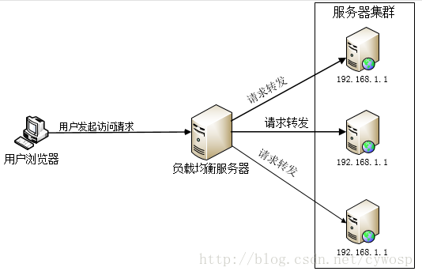
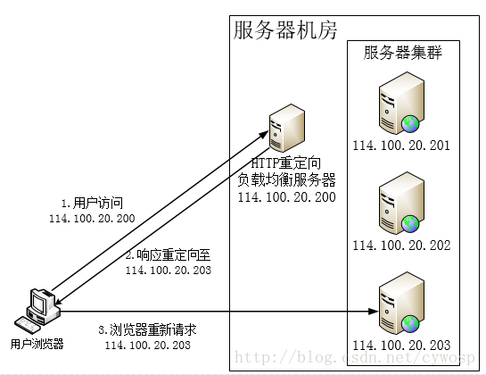
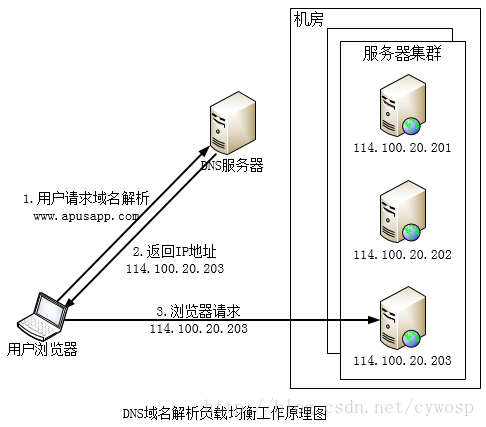
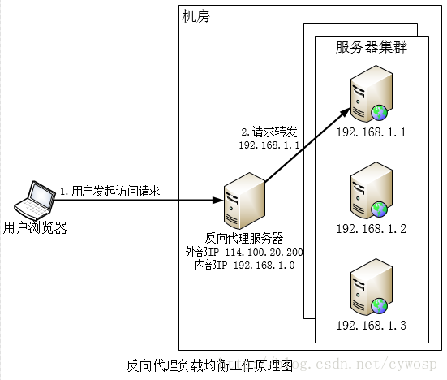
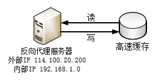
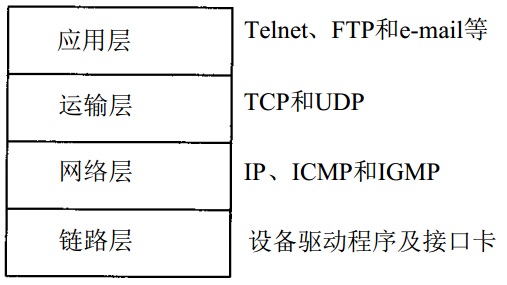
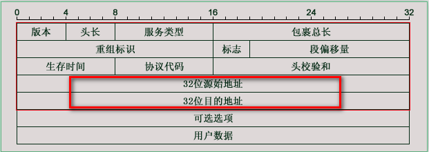
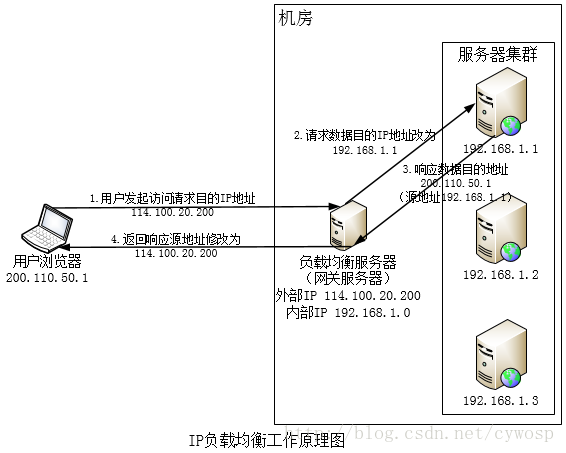
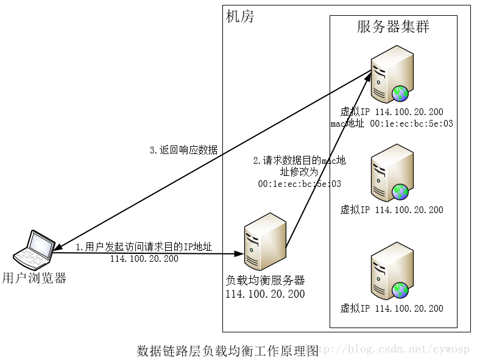

# 负载均衡
由于目前现有网络的各个核心部分随着业务量的提高，访问量和数据流量的快速增长，其处理能力和计算强度也相应地增大，使得单一的服务器设备根本无法承担。
在此情况下，如果扔掉现有设备去做大量的硬件升级，这样将造成现有资源的浪费，而且如果再面临下一次业务量的提升时，这又将导致再一次硬件升级的高额成本
投入，甚至性能再卓越的设备也不能满足当前业务量增长的需求。 针对此情况而衍生出来的一种廉价有效透明的方法以扩展现有网络设备和服务器的带宽、增加吞
吐量、加强网络数据处理能力、提高网络的灵活性和可用性的技术就是负载均衡（Load Balance）。

一个能够提供高并发访问，快速响应的服务器集群不是一开始就能设计出来的，但对于软件架构师而言，在架构设计之初就要有应付这种高并发，为集群提供水平扩
展的计划，具体何时进行扩展，就需要在后续处理业务的过程中慢慢演化了。同时，在设计之初，为了能快速扩展而不影响集群的正常使用，建议把服务器设计成无
状态的，也就是集群服务器不存储请求上下文信息，这样用户的请求被发往集群中的任何一个节点所处理的返回结果都将是一样的。因此在集群中就可以使用负载均
衡技术将不同的请求发往不同的节点上进行处理。如下图：

 负载均衡服务器需要能够感知或者可以配置集群中的服务器数量，可以及时发现集群中新上线或者下线的服务器，并能向新上线的服务器分发请求，停止向已下线
 的服务器分发请求，这样就实现了服务器集群的伸缩性。负载均衡的实现技术有多种多样，从硬件实现到软件实现，从商业产品到开源产品，应有尽有。本文主要
 介绍Web服务器中HTTP反向代理机制，以此来达到服务器之间的负载均衡

## 负载均衡之HTTP重定向
http://blog.csdn.net/cywosp/article/details/38014581

 HTTP重定向服务器是一台普通的应用服务器，其唯一个功能就是根据用户的HTTP请求计算出一台真实的服务器地址，并将该服务器地址写入HTTP重定向响应中
 （重定向响应状态码为302）返回给用户浏览器。用户浏览器在获取到响应之后，根据返回的信息，重新发送一个请求到真实的服务器上。如上图所示，
 浏览器访问www.apusapp.com DNS服务器解析到IP地址为114.100.20.200，即HTTP重定向服务器的IP地址。重定向服务器计根据某种负载均衡
 算法算出真实的服务器地址为114.100.20.203并返回给用户浏览器，用户浏览器得到返回后重新对114.100.20.203发起了请求，最后完成访问。

这种负载均衡方案的有点是比较简单，缺点是浏览器需要两次请求服务器才能完成一次访问，性能较差；同时，重定向服务器本身的处理能力有可能成为瓶颈，
整个集群的伸缩性规模有限；使用HTTP返回码302重定向，有可能使搜索引擎判断为SEO作弊，降低搜索排名。因此实践中很少使用这种负载均衡方案来部署

## 负载均衡之DNS域名解析
http://blog.csdn.net/cywosp/article/details/38017027

DNS（Domain Name System）是因特网的一项服务，它作为域名和IP地址相互映射的一个分布式数据库，能够使人更方便的访问互联网。人们在通过浏览器访问网站时
只需要记住网站的域名即可，而不需要记住那些不太容易理解的IP地址。在DNS系统中有一个比较重要的的资源类型叫做主机记录也称为A记录，A记录是用于名称解析
的重要记录，它将特定的主机名映射到对应主机的IP地址上。如果你有一个自己的域名，那么要想别人能访问到你的网站，你需要到特定的DNS解析服务商的服务器上
填写A记录，过一段时间后，别人就能通过你的域名访问你的网站了。DNS除了能解析域名之外还具有负载均衡的功能，下面是利用DNS工作原理处理负载均衡的工作原理图：

由上图可以看出，在DNS服务器中应该配置了多个A记录，如：

      www.apusapp.com IN A 114.100.20.201;

      www.apusapp.com IN A 114.100.20.202;

      www.apusapp.com IN A 114.100.20.203;

因此，每次域名解析请求都会根据对应的负载均衡算法计算出一个不同的IP地址并返回，这样A记录中配置多个服务器就可以构成一个集群，并可以实现负载均衡。
上图中，用户请求www.apusapp.com DNS根据A记录和负载均衡算法计算得到一个IP地址114.100.20.203，并返回给浏览器，浏览器根据该IP地址，访问真实的
物理服务器114.100.20.203。所有这些操作对用户来说都是透明的，用户可能只知道www.apusapp.com 这个域名

## 负载均衡之反向代理
http://blog.csdn.net/cywosp/article/details/38026809

反向代理（Reverse Proxy）方式是指以代理服务器来接受internet上的连接请求，然后将请求转发给内部网络上的服务器，并将从服务器上得到的结果返回给
internet上请求连接的客户端，此时代理服务器对外就表现为一个服务器，该服务器就可称之为代理服务器。由于代理服务器处在最终处理请求访问的服务器之前，
因此可以在代理服务器上做负载均衡。实际上，互联网中也大量的存在反向代理服务器提供代理功能的同时也提供负载均衡的功能。其工作原理如下图所示：

由上图可以推出，反向代理服务器，管理了一组服务器，可以根据对应的负载均衡算法将不同的请求转发到不同的服务器上。服务器处理完成的响应也通过代理服
务器返回给用户。由于内部服务器不直接对外提供访问，因此，内部服务器地址不需要使用外部IP，而反向代理服务器则需要配置双网卡，提供内部和对外访问的IP地址。

如上图，用户浏览器访问请求的地址是114.100.20.200，反向代理服务器接收到请求后，根据负载均衡算法计算得到一台真实的内部服务器地址192.168.1.1，并将用户
的请求转发到该服务器上，192.168.1.1处理完请求后将响应返回给反相代理服务器，反相代理服务器再将该响应的内容返回给用户。

与此同时，反相代理服务器还可以具有存储静态数据用于缓存的功能，从而加速处理用户请求，提高服务器处理性能，其工作原理大概如下图所示：

反向代理服务器转发请求处于应用层协议上，因此，也称之为应用层负载均衡。该负载均衡方案与反向代理服务器功能集成到了一起，部署相对简单，但是，反向代理
服务器会处理所有的请求和响应，其性能可能将会成为整个集群的瓶颈。

注：常用的代理服务器软件有：Fikker、Nginx、Squid等

## 负载均衡之IP
http://blog.csdn.net/cywosp/article/details/38036537

首先让我们来看看下面这张大家都非常熟悉的TCP/IP协议族的分层图：

关于每层在网络数据包传输过程中所起到的作用不是本文的重点，本文主要是讲解如何在网络层中使用IP来做服务器集群的负载均衡，为什么可以在这一层来做负载均衡。
下面在来看IP协议的报头格式：

内红色框内的源地址和目的地址是IP负载均衡功能的关键所在，IP负载均衡又可以称之为网络层负载均衡，其核心原理就是通过内核驱动更改IP的目的地址来完成数据负载均衡的，如下图：

如上图所示，用户请求数据包（源地址为200.110.50.1）到达负载均衡服务器114.100.20.200后，负载均衡服务器在内核进程获取网络数据包，根据一定的负载均衡算法
得到一台内部的真实服务器192.168.1.1，然后将数据包的目的IP修改为192.168.1.1，此后数据包将会被发往192.168.1.1的服务器上，服务器处理完后，将向负载均衡
服务器返回相应的数据包，负载均衡服务器在把源地址修改为114.100.20.200后将数据包传输给用户浏览器。在这一整个过程中，数据包没有通过用户的应用进程，因
此该负载均衡的性能是非常之高的。

根据以上的图和上文的讲解，大家可能会觉得这很容易实现，其实不然，在这里需要处理关键的地方就是如何将集群内部服务器处理完后的数据返回给负载均衡服务器。
因为，用户请求的数据包到达负载均衡服务器前的目的地址是114.100.20.200，源地址是200.110.50.1，通过负载均衡服务器修改后的目的地址是192.168.1.1，源地址
还是200.110.50.1，所以处理后返回的数据包目的地址将是200.110.50.1，源地址是192.168.1.1，最终返回的数据包要回到负载均衡服务器就成了问题。解决的办法大
概有如下两种：一、负载均衡服务器使用双网卡，一个对内一个对外，在修改请求数据包的目的IP的同时也修改源地址，将源地址设为自身的IP，即源地址转换（SNAT），
这样内部集群服务器响应会再回到负载均衡服务器；二、将负载均衡服务器作为真实物理服务器集群的网关服务器，这样所有的响应都将通过负载均衡服务器。

IP负载均衡在内核进程完成数据分发，处理性能得到了很好的提高。但是由于所有请求和响应都要经过负载均衡服务器，集群的最大响应数据吞吐量将受到负载均衡服务器
网卡带宽的限制，对于提供下载服务或者视频服务等需要大量传输数据的站点而言，这是难以满足需求的。要是能让响应数据包绕过负载均衡服务器直接发往用户机器上就
好了，有什么办法可以做到呢？当然有，那就是链路层的负载均衡，这将在下一博文中讲解

## 负载均衡之数据链路层
http://blog.csdn.net/cywosp/article/details/38056811

在TCP/IP协议中数据链路层处于最底层，以帧的形式传输和接受数据。在这一层中MAC(Media Access Control)寻址是主要功能。在网络中MAC又称之为MAC地址，用于表示互联网
上每个网卡的标识符，采用十六进制表示，共6个字节（48位），烧录在网卡内部。更形象的说MAC地址就像身份证号码，全球唯一。以太网中数据帧之间是通过MAC寻址来到达对
应的计算机网卡或者路由的，因此，服务器集群可以充分利用这一特性来进行负载均衡。

数据链路层负载均衡通过修改通信协议数据包的mac地址进行负载均衡，集群可以通过如下图的部署来达到负载均衡：

这种数据传输方式又称为三角传输，负载均衡数据分发过程中不修改IP地址，只修改目的MAC地址，通过配置真实物理服务器集群所有机器虚拟IP和负载均衡服务器IP一致，从
而达到不修改数据包的源地址和目的地址就可以进行数据分发的目的，由于实际处理请求的真实物理服务器IP和数据请求目的IP一致，不需要通过负载均衡服务器进行地址交换，
可将响应数据包直接返回给用户浏览器，避免负载均衡服务器网卡带宽成为瓶颈。这种负载均衡方式又称之为直接路由方式（DR）.

如上图所示，用户请求到达负载均衡服务器114.100.20.200后，负载均衡服务器将数据包的目的MAC地址更改为00:1e:ec:bc:5e:03，并不修改数据包目的IP，由于服务器集群所
有服务器的虚拟IP地址和负载均衡服务器IP地址一致，因此数据可以正常传输到达MAC地址为00:1e:ec:bc:5e:03的机器上，该服务器处理完之后，将响应数据包发送到网关服务
器，网关服务器直接将数据包发送给用户浏览器，响应数据不需要通过负载均衡服务器，这样就避免了负载均衡服务器成为传输瓶颈的可能。

使用三角传输模式的链路层负载均衡是目前大型网站使用最为广泛的一种负载均衡手段。在Linux平台上最好的链路层负载均衡开源产品是LVS(Linux Virtual Server)