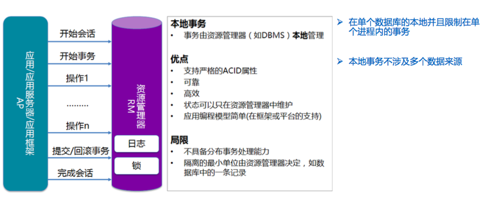
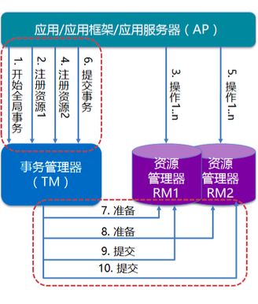
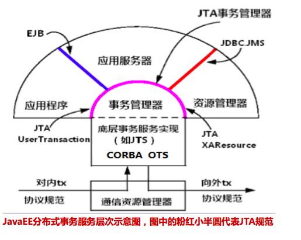

# 事务原理
 java事务学习笔记总结
http://blog.csdn.net/JordanInShenzhen/article/details/50997277

java事务处理全解析
http://blog.csdn.net/huilangeliuxin/article/details/43446177

Java中的事务——JDBC事务和JTA事务
http://www.hollischuang.com/archives/1658
Java中的事务——全局事务与本地事务
http://www.hollischuang.com/archives/1678

Spring的事务管理机制
http://www.hollischuang.com/archives/1489

JOTM开源的JTA实现
http://jotm.objectweb.org/?cm_mc_uid=54191904328114985460990&cm_mc_sid_50200000=1500800790

Spring 事务管理高级应用难点剖析
https://www.ibm.com/developerworks/cn/java/j-lo-spring-ts1/index.html
https://www.ibm.com/developerworks/cn/java/j-lo-spring-ts2/
https://www.ibm.com/developerworks/cn/java/j-lo-spring-ts3/index.html


```
事务
 |--本地事务
     |--JDBC事务
         |--Spring封装
         |--Hibernate/Mybaties等封装
         |--JAVA Connection
     |--容器事务
 |--全局事务
     |--JTA事务
         |--2PC
         |--3PC
     |--容器事务
```

## 数据库事务
事务应该具有4个属性：

1. **原子性（Atomicity）**：事务作为一个整体被执行，包含在其中的对数据库的操作要么全部被执行，要么都不执行。
1. **一致性（Consistency）**：事务应确保数据库的状态从一个一致状态转变为另一个一致状态。一致状态的含义是数据库中的数据应满足完整性约束。
1. **隔离性（Isolation）**：多个事务并发执行时，一个事务的执行不应影响其他事务的执行。
1. **持久性（Durability）**：一个事务一旦提交，他对数据库的修改应该永久保存在数据库中

当一个事务被提交给了DBMS（数据库管理系统），则DBMS需要确保该事务中的所有操作都成功完成且其结果被永久保存在数据库中，如果事务中有的操作没有成功完成，
则事务中的所有操作都需要被回滚，回到事务执行前的状态（要么全执行，要么全都不执行）;同时，该事务对数据库或者其他事务的执行无影响，
所有的事务都好像在独立的运行

事务保证了一个操作序列可以全部都执行或者全部都不执行（原子性），从一个状态转变到另外一个状态（一致性）。由于事务满足久性。所以一旦事务被提交之后，
数据就能够被持久化下来，又因为事务是满足隔离性的，所以，当多个事务同时处理同一个数据的时候，多个事务直接是互不影响的，所以，在多个事务并发操作的
过程中，如果控制不好隔离级别，就有可能产生脏读、不可重复读或者幻读等读现象

1. **脏读**：脏读又称无效数据的读出，是指在数据库访问中，事务T1将某一值修改，然后事务T2读取该值，此后T1因为某种原因撤销对该值的修改，
    这就导致了T2所读取到的数据是无效的
1. **不可重复读**：不可重复读，是指在数据库访问中，一个事务范围内两个相同的查询却返回了不同数据。这是由于查询时系统中其他事务修改的
    提交而引起的。比如事务T1读取某一数据，事务T2读取并修改了该数据，T1为了对读取值进行检验而再次读取该数据，便得到了不同的结果
1. **幻读**：幻读是指当事务不是独立执行时发生的一种现象，例如第一个事务对一个表中的数据进行了修改，比如这种修改涉及到表中的“全部数据行”。
    同时，第二个事务也修改这个表中的数据，这种修改是向表中插入“一行新数据”。那么，以后就会发生操作第一个事务的用户发现表中还有没有修改的
    数据行，就好象发生了幻觉一样.一般解决幻读的方法是增加范围锁RangeS，锁定检锁范围为只读，这样就避免了幻读

深入分析事务的隔离级别：
http://www.hollischuang.com/archives/943

在数据库事务的ACID四个属性中，隔离性是一个最常放松的一个。可以在数据操作过程中利用数据库的锁机制或者多版本并发控制机制获取更高的隔离等级。
但是，随着数据库隔离级别的提高，数据的并发能力也会有所下降。DBMS定义了多个不同的“事务隔离等级”来控制锁的程度和并发能力。ANSI/ISO SQL定义的
标准隔离级别有四种，从高到底依次为：可序列化(Serializable)、可重复读(Repeatable reads)、提交读(Read committed)、未提交读(Read uncommitted)

1. **未提交读(Read uncommitted)**：一个事务可以读到另外一个事务未提交的数据
    - 事务在读数据的时候并未对数据加锁
    - 事务在修改数据的时候只对数据增加行级共享锁
1. **提交读(Read committed)**：在一个事务修改数据过程中，如果事务还没提交，其他事务不能读该数据
    - 事务对当前被读取的数据加行级共享锁（当读到时才加锁），一旦读完该行，立即释放该行级共享锁
    - 事务在更新某数据的瞬间（就是发生更新的瞬间），必须先对其加行级排他锁，直到事务结束才释放
1. **可重复读(Repeatable reads)**：提交读隔离级别会产生不可重复读的读现象。所以，比提交读更高一个级别的隔离级别就可以解决不可重复读的问题。这种隔离级别就叫可重复读
    - 事务在读取某数据的瞬间（就是开始读取的瞬间），必须先对其加行级共享锁，直到事务结束才释放
    - 事务在更新某数据的瞬间（就是发生更新的瞬间），必须先对其加行级排他锁，直到事务结束才释放
1. **可序列化(Serializable)**：前面提到的所有的隔离级别都无法解决的幻读，在可序列化的隔离级别中可以解决
    - 事务在读取数据时，必须先对其加 表级共享锁 ，直到事务结束才释放
    - 事务在更新数据时，必须先对其加 表级排他锁 ，直到事务结束才释放


## 解决数据一致性的问题
1. **Weak 弱一致性**：当你写入一个新值后，读操作在数据副本上可能读出来，也可能读不出来。比如：某些cache系统，
    网络游戏其它玩家的数据和你没什么关系，VOIP这样的系统，或是百度搜索引擎（呵呵）。
1. **Eventually 最终一致性**：当你写入一个新值后，有可能读不出来，但在某个时间窗口之后保证最终能读出来。
   比如：DNS，电子邮件、Amazon S3，Google搜索引擎这样的系统。
1. **Strong 强一致性**：新的数据一旦写入，在任意副本任意时刻都能读到新值。比如：文件系统，RDBMS，Azure Table都是强一致性的

Weak和Eventually一般来说是异步冗余的，而Strong一般来说是同步冗余的，异步的通常意味着更好的性能，
但也意味着更复杂的状态控制。同步意味着简单，但也意味着性能下降

# 1.本地事务



## Spring事务支持

## Hibernate事务支持

## JAVA事务支持

## 数据库事务支持

# 2.全局事务/分布式事务
分布式系统的事务处理
http://coolshell.cn/articles/10910.html

关于分布式事务、两阶段提交协议、三阶提交协议
http://www.hollischuang.com/archives/681

JTA 深度历险 - 原理与实现
https://www.ibm.com/developerworks/cn/java/j-lo-jta/



全局事务是一个DTP模型的事务，所谓DTP模型指的是X/Open DTP(X/Open Distributed Transaction Processing Reference Model)，
是X/Open 这个组织定义的一套分布式事务的标准，也就是了定义了规范和API接口，由这个厂商进行具体的实现

1. **AP(Application Program)**：也就是应用程序，可以理解为使用DTP的程序
1. **RM(Resource Manager)**：资源管理器，这里可以理解为一个DBMS系统，或者消息服务器管理系统，应用程序通过资源管理器对资源进行控制。
1. **TM(Transaction Manager)**：事务管理器，负责协调和管理事务，提供给AP应用程序编程接口以及管理资源管理器。
1. **XA协议**：应用或应用服务器与事务管理之前通信的接口
1. **TX协议**：全局事务管理器与资源管理器之间通信的接口

事务管理器控制着全局事务，管理事务生命周期，并协调资源。资源管理器负责控制和管理实际资源

Java自身提供了一些API可以用来实现全局事务



1. **JTA(Java Transaction API)**:面向应用、应用服务器与资 源管理器的高层事务接口。
1. **JTS(Java Transaction Service)**:JTA事务管理器的实现标 准,向上支持JTA,向下通过CORBA OTS实现跨事务域的互 操作性。
1. **EJB**:基于组件的应用编程模型,通过声明式事务管理进一步 简化事务应用的编程

## JTA

## 2PC/3PC