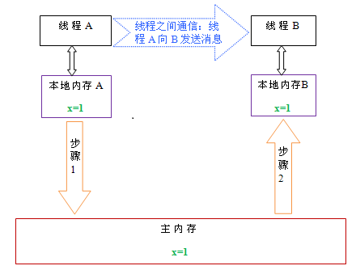
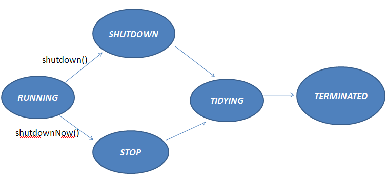

## 线程
现实方式：
1.  集成Thread，实现run方法
2. 实现接口Runnable，然后通过Thread启动

### 1. 线程

#### 线程状态


1. start:现成启动方法
2. sleep:在指定的毫秒数内让当前正在执行的线程休眠（暂停执行），此操作受到系统计时器和调度程序精度和准确性的影响不能改变对象的机锁
3. yield:停止当前线程，让同等优先权的线程运行。如果没有同等优先权的线程，那么Yield()方法将不会起作用
4. stop/interrupt:使当前线程停下来等待，直至另一个调用join方法的线程终止
5. join:(通过wait实现) thread.Join把指定的线程加入到当前线程，可以将两个交替执行的线程合并为顺序执行的线程。比如在线程B中调用了线程A的Join()方法，直到线程A执行完毕后，才会继续执行线程B
t.join();      //调用join方法，等待线程t执行完毕
t.join(1000);  //等待 t 线程，等待时间是1000毫秒

#### ThreadLocal
用处：保存线程的独立变量。对一个线程类（继承自Thread)
当使用ThreadLocal维护变量时，ThreadLocal为每个使用该变量的线程提供独立的变量副本，所以每一个线程都可以独立地改变自己的副本，而不会影响其它线程所对应的副本。常用于用户登录控制，如记录session信息。

实现：每个Thread都持有一个TreadLocalMap类型的变量（该类是一个轻量级的Map，功能与map一样，区别是桶里放的是entry而不是entry的链表。功能还是一个map。）以本身为key，以目标为value。
主要方法是get()和set(T a)，set之后在map里维护一个threadLocal -> a，get时将a返回。ThreadLocal是一个特殊的容器
```
private static ThreadLocal<Integer> count = new ThreadLocal<>();
private static ThreadLocal<Integer> sum = new ThreadLocal<>();
Thread t1 = new Thread(() -> {
    count.set(10);
    sum.set(100);
});
t1.start();
Thread t2 = new Thread(() -> {
    count.set(20);
    sum.set(200);
});
t2.start();

Thread-1
  |--ThreadLocalMap<ThreadLocal,value>
        |--hash(count)-->10
        |--hash(sum)-->100
Thread-2
  |--ThreadLocalMap<ThreadLocal,value>
        |--hash(count)-->20
        |--hash(sum)-->200

ThreadLocal.get
    |--ThreadLocalMap < Thread.currentThread().threadLocals
        |--ThreadLocalMap.Entry < ThreadLocalMap.getEntry(this)  this是ThreadLocal
            |--ThreadLocalMap.Entry.value

ThreadLocal.set
    |--ThreadLocalMap < Thread.currentThread().threadLocals
        |--ThreadLocalMap.set(this,value)
```

### 2. 多线程

#### 2.1 volatile变量
1. `保证线程之间变量的可见性`
2. `禁止指令重排序`
3. 不能保证程序的原子性/一定程度保证有序性
4. 场景：多线程的状态标记量；单实例的double check

###### 2.1.1 多线程的内存模型

1.  原子性：即一个操作或者多个操作 要么全部执行并且执行的过程不会被任何因素打断，要么就都不执行
2. 可见性：可见性是指当多个线程访问同一个变量时，一个线程修改了这个变量的值，其他线程能够立即看得到修改的值
3. 有序性：即程序执行的顺序按照代码的先后顺序执行；happens-before规则




#### 2.2 线程同步
两种方式实现现成同步synchronized和Lock；使用规则可定时的、可轮询的与可中断的锁获取操作，公平队列，已经非块结构的锁使用Lock，否则优先使用synchronized

###### 2.2.1 synchronized（块、方法）

Java Monitor 从两个方面来支持线程之间的同步，即：互斥执行与协作。 Java 使用对象锁 ( 使用 synchronized 获得对象锁 ) 保证工作在共享的数据集上的线程互斥执行 ,
使用 notify/notifyAll/wait 方法来协同不同线程之间的工作。这些方法在 Object 类上被定义，会被所有的 Java 对象自动继承

以下几种方式获取对象的Monitor
```
public synchronize a () {}
synchronize(obj) {}
public static synchronize b(){}
```


tips：拥有monitor的是线程

1.同时只能有一个线程可以获取某个对象的monitor

2.一个线程通过调用某个对象的wait()方法释放该对象的monitor并进入休眠状态，直到其他线程调用该对象的notify()或者notifyAll()再次获取该对象的monitor

3.只有拥有该对象monitor的线程才可以调用该对象的notify()和notifyAll()方法，如果没有该对象monitor的线程调用了该对象的notify()或者notifyAll()方法将会抛出java.lang.IllegalMonitorStateException


###### 2.2.2 Lock锁

`自旋锁：`

(公平锁/非公平锁[可插队])AbstractQueuedSynchronizer

ReentrantLock(重入锁)：
 - lock:获取锁，如果锁无法获取，那么当前的线程就变为不可被调度，直到锁被获取到
 - tryLock:如果调用的时候能够获取锁，那么就获取锁并且返回true，如果当前的锁无法获取到，那么这个方法会立刻返回false
 - unlock:释放当前线程占用的锁
 - newCondition:返回一个与当前的锁关联的条件变量。在使用这个条件变量之前，当前线程必须占用锁。调用Condition的await方法，会在等待之前原子地释放锁，并在等待被唤醒后原子的获取锁

`实现：`

初始化时， state=0，表示无人抢占了打水权。这时候，村民A来打水(A线程请求锁)，占了打水权，把state+1，如下所示：


线程A取得了锁，把 state原子性+1,这时候state被改为1，A线程继续执行其他任务，然后来了村民B也想打水（线程B请求锁），线程B无法获取锁，生成节点进行排队，如下图所示：


初始化的时候，会生成一个空的头节点，然后才是B线程节点，这时候，如果线程A又请求锁，是否需要排队？答案当然是否定的，否则就直接死锁了。当A再次请求锁，就相当于是打水期间，同一家人也来打水了，是有特权的，这时候的状态如下图所示：


到了这里，相信大家应该明白了什么是可重入锁了吧。就是一个线程在获取了锁之后，再次去获取了同一个锁，这时候仅仅是把状态值进行累加。如果线程A释放了一次锁，就成这样了：


仅仅是把状态值减了，只有线程A把此锁全部释放了，状态值减到0了，其他线程才有机会获取锁。当A把锁完全释放后，state恢复为0，然后会通知队列唤醒B线程节点，使B可以再次竞争锁。当然，如果B线程后面还有C线程，C线程继续休眠，除非B执行完了，通知了C线程。注意，当一个线程节点被唤醒然后取得了锁，对应节点会从队列中删除。

ReentrantReadWriteLock：
读写锁 ReadWriteLock读写锁维护了一对相关的锁，一个用于只读操作，一个用于写入操作。只要没有writer，读取锁可以由多个reader线程同时保持。写入锁是独占的

StampedLock：该类是一个读写锁的改进，它的思想是读写锁中读不仅不阻塞读，同时也不应该阻塞写。
读不阻塞写的实现思路：在读的时候如果发生了写，则应当重读而不是在读的时候直接阻塞写

###### 2.2.3 同步器
`CountDownLatch：` 能够使一个线程等待其他线程完成各自的工作后再执行。例如，应用程序的主线程希望在负责启动框架服务的线程已经启动所有的框架服务之后再执行

通过一个计数器来实现的，计数器的初始值为线程的数量。每当一个线程完成了自己的任务后，计数器的值就会减1。当计数器值到达0时，它表示所有的线程已经完成了任务，然后在闭锁上等待的线程就可以恢复执行任务

使用场景：
  - 开始执行前等待n个线程完成各自任务：例如应用程序启动类要确保在处理用户请求前，所有N个外部系统已经启动和运行了。
  - 死锁检测：一个非常方便的使用场景是，你可以使用n个线程访问共享资源，在每次测试阶段的线程数目是不同的，并尝试产生死锁

`Semaphore：`可以很轻松完成信号量控制，Semaphore可以控制某个资源可被同时访问的个数，通过 acquire() 获取一个许可，如果没有就等待，而 release() 释放一个许可。比如在Windows下可以设置共享文件的最大客户端访问个数

Semaphore维护了当前访问的个数，提供同步机制，控制同时访问的个数。在数据结构中链表可以保存“无限”的节点，用Semaphore可以实现有限大小的链表。另外重入锁 ReentrantLock 也可以实现该功能，但实现上要复杂些

`CyclicBarrier：`一个同步辅助类，它允许一组线程互相等待，直到到达某个公共屏障点 (common barrier point)。在涉及一组固定大小的线程的程序中，这些线程必须不时地互相等待，此时 CyclicBarrier 很有用。因为该 barrier 在释放等待线程后可以重用，所以称它为循环 的 barrier

使用场景：
需要所有的子任务都完成时，才执行主任务，这个时候就可以选择使用CyclicBarrier。

`Phaser`：涵盖CountDownLatch和CyclicBarrier的功能

`Exchanger：`可以在两个线程之间交换数据，只能是2个线程，他不支持更多的线程之间互换数据。

当线程A调用Exchange对象的exchange()方法后，他会陷入阻塞状态，直到线程B也调用了exchange()方法，然后以线程安全的方式交换数据，之后线程A和B继续运行


#### 2.3 线程池（管理类）

Java中的线程池——ThreadPoolExecutor的原理
http://blog.csdn.net/u010723709/article/details/50372322

###### 常用方法介绍
new  ThreadPoolExecutor(corePoolSize, maximumPoolSize, keepAliveTime, milliseconds,runnableTaskQueue, handler);
- corePoolSize（线程池的基本大小）：当提交一个任务到线程池时，线程池会创建一个线程来执行任务，即使其他空闲的基本线程能够执行新任务也会创建线程，
   等到需要执行的任务数大于线程池基本大小时就不再创建。如果调用了线程池的prestartAllCoreThreads方法，线程池会提前创建并启动所有基本线程。
- runnableTaskQueue（任务队列）：用于保存等待执行的任务的阻塞队列。 可以选择以下几个阻塞队列。
  - ArrayBlockingQueue：是一个基于数组结构的有界阻塞队列，此队列按 FIFO（先进先出）原则对元素进行排序。
  - LinkedBlockingQueue：一个基于链表结构的阻塞队列，此队列按FIFO （先进先出） 排序元素，吞吐量通常要高于ArrayBlockingQueue。静态工厂方法Executors.newFixedThreadPool()使用了这个队列。
  - SynchronousQueue：一个不存储元素的阻塞队列。每个插入操作必须等到另一个线程调用移除操作，否则插入操作一直处于阻塞状态，吞吐量通常要高于LinkedBlockingQueue，静态工厂方法Executors.newCachedThreadPool使用了这个队列。
  - PriorityBlockingQueue：一个具有优先级的无限阻塞队列。
- maximumPoolSize（线程池最大大小）：线程池允许创建的最大线程数。如果队列满了，并且已创建的线程数小于最大线程数，则线程池会再创建新的线程执行任务。值得注意的是如果使用了无界的任务队列这个参数就没什么效果。
- ThreadFactory：用于设置创建线程的工厂，可以通过线程工厂给每个创建出来的线程设置更有意义的名字。
- RejectedExecutionHandler（饱和策略）：当队列和线程池都满了，说明线程池处于饱和状态，那么必须采取一种策略处理提交的新任务。这个策略默认情况下是AbortPolicy，表示无法处理新任务时抛出异常。以下是JDK1.5提供的四种策略。
  - AbortPolicy：直接抛出异常。
  - CallerRunsPolicy：只用调用者所在线程来运行任务。
  - DiscardOldestPolicy：丢弃队列里最近的一个任务，并执行当前任务。
  - DiscardPolicy：不处理，丢弃掉。
  - 当然也可以根据应用场景需要来实现RejectedExecutionHandler接口自定义策略。如记录日志或持久化不能处理的任务。
- keepAliveTime（线程活动保持时间）：存活时间，分两种情况： (1)allowCoreThreadTimeOut=true，所有线程，一旦创建后，在keepAliveTime时间内，如果没有任务可以执行，则该线程会退出并销毁，
  这样的好处是系统不忙时可以回收线程资源；(2)allowCoreThreadTimeOut=false，如果总线程数<=corePoolSize，那么这些线程是不会退出的，他们会一直不断的等待任务并执行，
  哪怕当前没有任务，但如果线程数>corePoolSize，而且一旦一个线程闲的时间超过keepAliveTime则会退出，但一旦降低到corePoolSize，则不会再退出了
- TimeUnit（线程活动保持时间的单位）：可选的单位有天（DAYS），小时（HOURS），分钟（MINUTES），毫秒(MILLISECONDS)，微秒(MICROSECONDS, 千分之一毫秒)和毫微秒(NANOSECONDS, 千分之一微秒)

Java通过Executors提供四种线程池，分别为：
- newCachedThreadPool new ThreadPoolExecutor(0, Integer.MAX_VALUE,60L, TimeUnit.SECONDS,new SynchronousQueue<Runnable>()) 创建一个可缓存线程池，如果线程池长度超过处理需要，可灵活回收空闲线程，若无可回收，则新建线程。
- newFixedThreadPool new ThreadPoolExecutor(nThreads, nThreads,0L, TimeUnit.MILLISECONDS,new LinkedBlockingQueue<Runnable>())创建一个定长线程池，可控制线程最大并发数，超出的线程会在队列中等待。
- newScheduledThreadPool 创建一个定长线程池，支持定时及周期性任务执行。
- newSingleThreadExecutor 创建一个单线程化的线程池，它只会用唯一的工作线程来执行任务，保证所有任务按照指定顺序(FIFO, LIFO, 优先级)执行

###### 线程池执行流程


```java
public void execute(Runnable command) {
    if (command == null)
       throw new NullPointerException();
    //如果线程数小于基本线程数，则创建线程并执行当前任务
    if (poolSize >= corePoolSize || !addIfUnderCorePoolSize(command)) {
    //如线程数大于等于基本线程数或线程创建失败，则将当前任务放到工作队列中。
        if (runState == RUNNING && workQueue.offer(command)) {
            if (runState != RUNNING || poolSize == 0)
                      ensureQueuedTaskHandled(command);
        }
    //如果线程池不处于运行中或任务无法放入队列，并且当前线程数量小于最大允许的线程数量，则创建一个线程执行任务。
        else if (!addIfUnderMaximumPoolSize(command))
        //抛出RejectedExecutionException异常
            reject(command); // is shutdown or saturated
    }
}

线程池创建线程时，会将线程封装成工作线程Worker，Worker在执行完任务后，还会无限循环获取工作队列里的任务来执行。我们可以从Worker的run方法里看到这点:
public void run() {
     try {
           Runnable task = firstTask;
           firstTask = null;
            while (task != null || (task = getTask()) != null) {
                    runTask(task);
                    task = null;
            }
      } finally {
             workerDone(this);
      }
}
```

###### 线程池状态



`RUNNING状态：`
创建线程池的时候，线程池的初始状态为 RUNNING，接着就可以提交任务执行了。

`SHUTDOWN状态：`
当在RUNNING状态调用shutdown()时，线程池状态会被改为SHUTDOWN，这时候，submit任务的时候，会被拒绝，可以使用多种拒绝策略，
比如最简单就是直接丢弃任务。至于正在执行中的线程，会继续执行，同时会把阻塞队列中的任务也一并执行完毕，等到全部任务执行完毕，线程池会进入 TIDYING状态，等执行钩子方法terminated()之后，就会进入最终状态TERMINATED，这时候，整个线程池完全终止。

`STOP状态：`
当在RUNNING状态调用shutdownNow()时，线程池状态会被改为STOP，这时候，submit任务会被拒绝，那么如果有任务执行到一半，该怎么处理？其实，执行shutdownNow()时，会中断各个工作线程，所以任务会如何执行要看任务做的是什么事情，有没有处理中断异常。而阻塞队列如何有任务，这些任务将不会再执行，shutdownNow()执行后，将会返回阻塞队列中的未执行的任务列表。

`TIDYING状态：`
TIDYING只是一个过渡状态，当所有工作线程都停止后，线程池的状态会进入TIDYING，然后执行一个钩子方法terminated()，最后线程池会进入TERMINATED状态。

`TERMINATED状态：`
线程池终止状态，这个没什么可说的了，大家都明白

#### 2.4 线程安全集合（容器类）

1. ConcurrentMap
   - ConcurrentHashMap：Hashtable和synchonized map都会防止其他线程访问这个map，但是ConcurrentHashMap不一样，它采用的是分段锁，最大16个
   - ConcurrentSkipListMap
2. List
   - CopyOnWriteArrayList
   - CopyOnWriteArraySet
3. Queue
   - ArrayBlockingQueue
   - LinkedBlockingQueue

#### 2.5 Atomic原子操作

`通过volatile和CAS(compare and swap)实现`

Atomic包是java.util.concurrent下的另一个专门为线程安全设计的Java包，包含多个原子操作
类。这个包里面提供了一组原子变量类。其基本的特性就是在多线程环境下，当有多个线程
同时执行这些类的实例包含的方法时，具有排他性，即当某个线程进入方法，执行其中的指
令时，不会被其他线程打断，而别的线程就像自旋锁一样，一直等到该方法执行完成，才由J
VM从等待队列中选择一个另一个线程进入，这只是一种逻辑上的理解。实际上是借助硬件的
相关指令来实现的，不会阻塞线程(或者说只是在硬件级别上阻塞了)。可以对基本数据、数组
中的基本数据、对类中的基本数据进行操作。原子变量类相当于一种泛化的volatile变量，能
够支持原子的和有条件的读-改-写操作