Github源码：
https://github.com/Netflix/eureka

深度剖析服务发现组件Netflix Eureka
http://techshow.ctrip.com/archives/1699.html?utm_source=tuicool&utm_medium=referral

Netflix Eureka 深层解析（上）
http://blog.csdn.net/u011834741/article/details/54694045

Netflix Eureka 深层解析（下）
http://blog.csdn.net/u011834741/article/details/54709209


## 1.服务注册/发现理论知识

## 2.Netflix Eureka
1. 是纯正的 servlet 应用，需构建成war包部署
2. 使用了 Jersey 框架实现自身的 RESTful HTTP接口
3. peer之间的同步与服务的注册全部通过 HTTP 协议实现
4. 定时任务(发送心跳、定时清理过期服务、节点同步等)通过 JDK 自带的 Timer 实现
5. 内存缓存使用Google的guava包实现

使用了Eureka几方面的原因：

1. 它提供了完整的Service Registry和Service Discovery实现首先是提供了完整的实现，
    并且也经受住了Netflix自己的生产环境考验，相对使用起来会比较省心。
2. 和Spring Cloud无缝集成我们的项目本身就使用了Spring Cloud和Spring Boot，同时Spring Cloud
    还有一套非常完善的开源代码来整合Eureka，所以使用起来非常方便。另外，Eureka还支持在我们
    应用自身的容器中启动，也就是说我们的应用启动完之后，既充当了Eureka的角色，同时也是服务
    的提供者。这样就极大的提高了服务的可用性。这一点是我们选择Eureka而不是zk、etcd等的主要
    原因，为了提高配置中心的可用性和降低部署复杂度，我们需要尽可能地减少外部依赖。
3. Open Source最后一点是开源，由于代码是开源的，所以非常便于我们了解它的实现原理和排查问题

## 2关键技术点
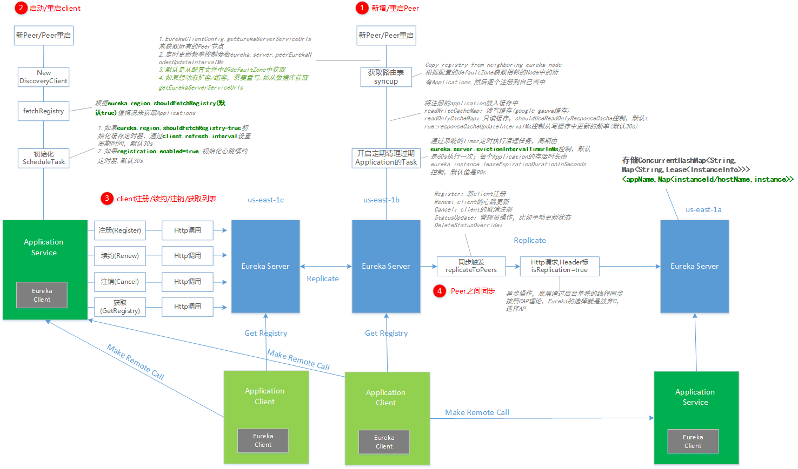

### 2.1 服务注册：Register

#### 2.1.1 server端
首先来看Register（服务注册），这个接口会在Service Provider启动时被调用来实现服务注册。同时，当Service Provider的服务状态发生变化时（如自身检测认为Down的时候），也会调用来更新服务状态。

参数：

接口实现比较简单，如下图所示:

1. ApplicationResource类接收Http服务请求，调用PeerAwareInstanceRegistryImpl的register方法
2. PeerAwareInstanceRegistryImpl完成服务注册后，调用replicateToPeers向其它Eureka Server节点（Peer）做状态同步（异步操作）

注册的服务列表保存在一个嵌套的hash map中：
private final ConcurrentHashMap<String, Map<String, Lease<InstanceInfo>>> registry =new ConcurrentHashMap<String, Map<String, Lease<InstanceInfo>>>();

1. 第一层hash map的key是app name，也就是应用名字
2. 第二层hash map的key是instance name，也就是实例名字

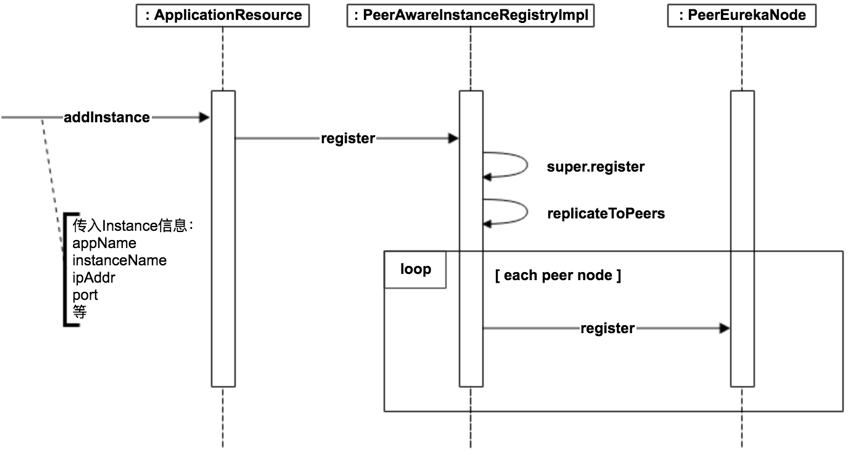

#### 2.1.2 client端

Service Provider要对外提供服务，一个很重要的步骤就是把自己注册到Eureka Server上。

这部分的实现比较简单，只需要在启动时和实例状态变化时调用Eureka Server的接口注册即可。需要注意的是，需要确保配置eureka.client.registerWithEureka=true:

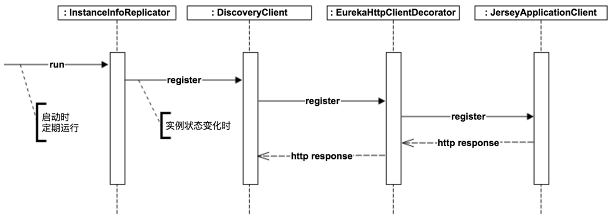

### 2.2 服务续约：Renew

#### 2.2.1 server端
Renew（服务续约）操作由Service Provider定期调用，类似于heartbeat。主要是用来告诉Eureka Server Service Provider还活着，避免服务被剔除掉。接口实现如下图所示：

可以看到，接口实现方式和register基本一致：首先更新自身状态，再同步到其它Peer

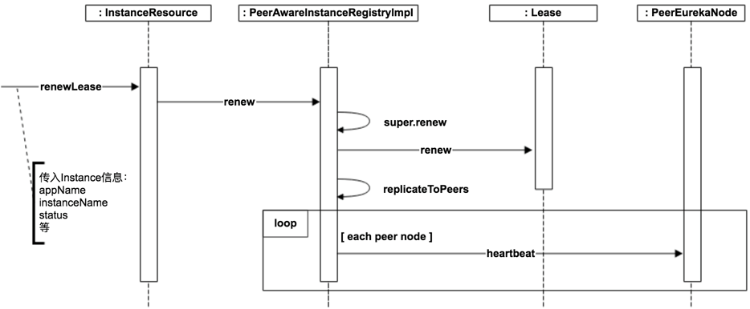

#### 2.2.2 client端
Renew操作会在Service Provider端定期发起，用来通知Eureka Server自己还活着。 这里有两个比较重要的配置需要注意一下：

instance.leaseRenewalIntervalInSeconds
Renew频率。默认是30秒，也就是每30秒会向Eureka Server发起Renew操作。

instance.leaseExpirationDurationInSeconds
服务失效时间。默认是90秒，也就是如果Eureka Server在90秒内没有接收到来自Service Provider的Renew操作，就会把Service Provider剔除。

具体实现如下：

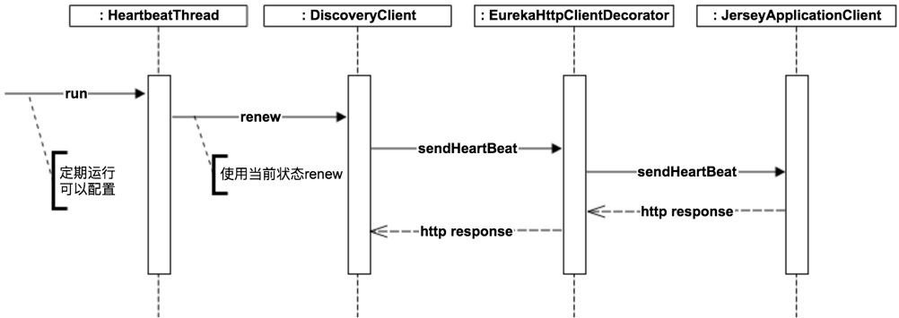

### 2.3 服务注销：Cancel
#### 2.3.1 server端
Cancel（服务下线）一般在Service Provider shut down的时候调用，用来把自身的服务从Eureka Server中删除，以防客户端调用不存在的服务。接口实现如下图所示：

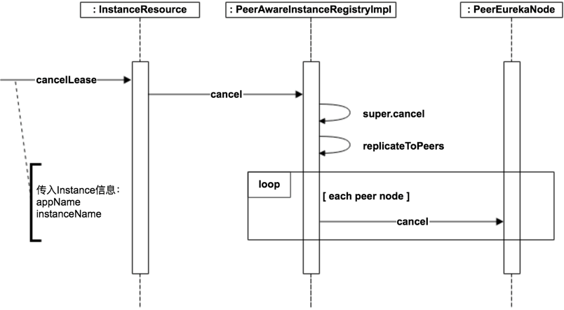

#### 2.3.2 client端
在Service Provider服务shut down的时候，需要及时通知Eureka Server把自己剔除，从而避免客户端调用已经下线的服务。

逻辑本身比较简单，通过对方法标记@PreDestroy，从而在服务shut down的时候会被触发

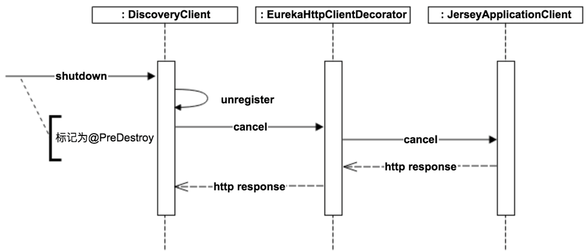

### 2.4 获取服务列表：Fetch Registries
#### 2.4.1 server端
Fetch Registries由Service Consumer调用，用来获取Eureka Server上注册的服务，可以根据

为了提高性能，服务列表在Eureka Server会缓存一份，同时每30秒更新一次

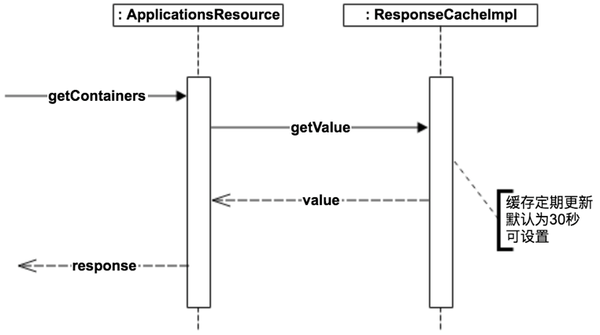

#### 2.4.2 client端
`Fetch Service Registries`:Service Consumer在启动时会从Eureka Server获取所有服务列表，并在本地缓存。需要注意的是，需要确保配置eureka.client.shouldFetchRegistry=true

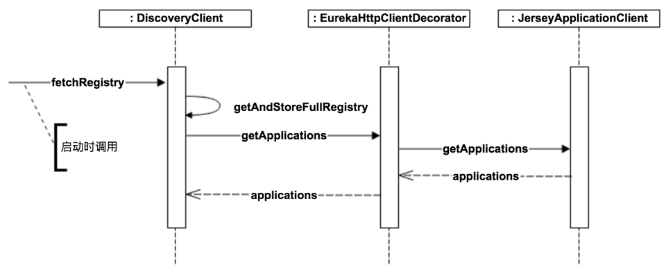

`Update Service Registries`:由于在本地有一份缓存，所以需要定期更新，定期更新频率可以通过eureka.client.registryFetchIntervalSeconds配置

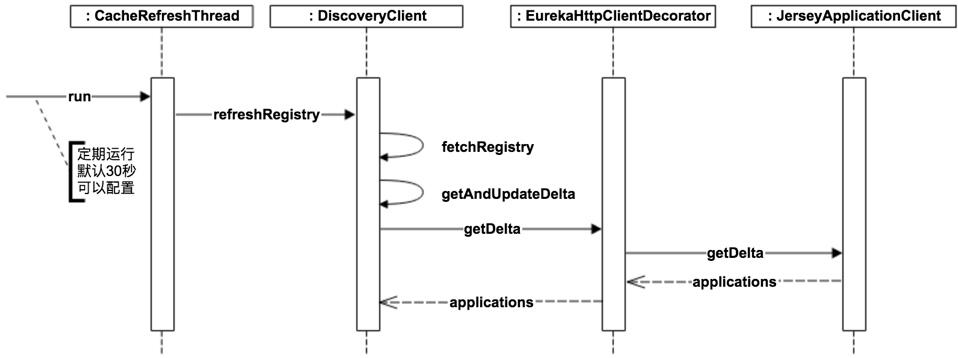

### 2.5 server端中client的失效剔除：Eviction
Eviction（失效服务剔除）用来定期（默认为每60秒）在Eureka Server检测失效的服务，检测标准就是超过一定时间没有Renew的服务。

默认失效时间为90秒，也就是如果有服务超过90秒没有向Eureka Server发起Renew请求的话，就会被当做失效服务剔除掉。

失效时间可以通过eureka.instance.leaseExpirationDurationInSeconds进行配置，定期扫描时间可以通过eureka.server.evictionIntervalTimerInMs进行配置。

接口实现逻辑见下图：

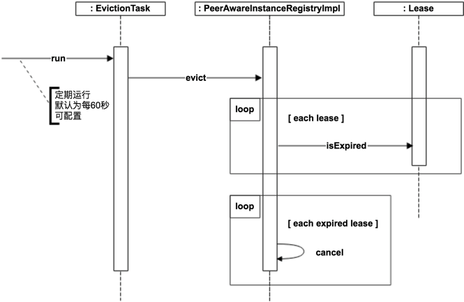

### 2.6 peer与peer之间的同步：How Peer Replicates
在前面的Register、Renew、Cancel接口实现中，我们看到了都会有replicateToPeers操作，这个就是用来做Peer之间的状态同步，如果同步失败的话，系统不会重试，等待下载同步。

通过这种方式，Service Provider只需要通知到任意一个Eureka Server后就能保证状态会在所有的Eureka Server中得到更新。

具体实现方式其实很简单，就是接收到Service Provider请求的Eureka Server，把请求再次转发到其它的Eureka Server，调用同样的接口，传入同样的参数，除了会在header中标记isReplication=true，从而避免重复的replicate。

Peer之间的状态是采用异步的方式同步的，所以不保证节点间的状态一定是一致的，不过基本能保证最终状态是一致的。

结合服务发现的场景，实际上也并不需要节点间的状态强一致。在一段时间内（比如30秒），节点A比节点B多一个服务实例或少一个服务实例，在业务上也是完全可以接受的（Service Consumer侧一般也会实现错误重试和负载均衡机制）。

所以按照CAP理论，Eureka的选择就是放弃C，选择AP。

### 2.7 How Peer Nodes/Eureka Servers are Discovered
#### 2.7.1 server端（Peer Nodes）
那大家可能会有疑问，Eureka Server是怎么知道有多少Peer的呢？

Eureka Server在启动后会调用EurekaClientConfig.getEurekaServerServiceUrls来获取所有的Peer节点，并且会定期更新。定期更新频率可以通过eureka.server.peerEurekaNodesUpdateIntervalMs配置。

这个方法的默认实现是从配置文件读取，所以如果Eureka Server节点相对固定的话，可以通过在配置文件中配置来实现。

如果希望能更灵活的控制Eureka Server节点，比如动态扩容/缩容，那么可以override getEurekaServerServiceUrls方法，提供自己的实现，比如我们的项目中会通过数据库读取Eureka Server列表。

具体实现如下图所示：

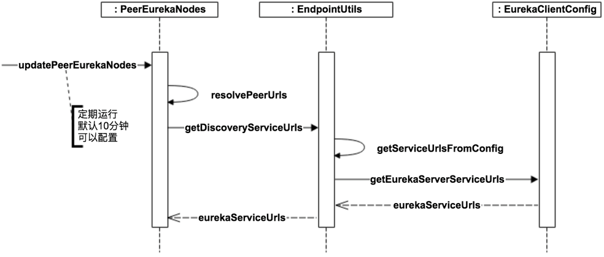

#### 2.7.2 client端（Eureka Servers）
这里大家疑问又来了，Service Provider是怎么知道Eureka Server的地址呢？

其实这部分的主体逻辑和3.3.7 How Peer Nodes are Discovered几乎是一样的。

也是默认从配置文件读取，如果需要更灵活的控制，可以通过override getEurekaServerServiceUrls方法来提供自己的实现。定期更新频率可以通过eureka.client.eurekaServiceUrlPollIntervalSeconds配置

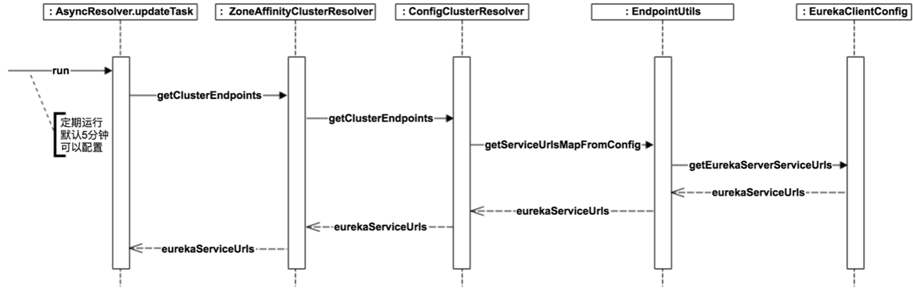

### 2.8 新peer节点的启动：How New Peer Initializes
最后再来看一下一个新的Eureka Server节点加进来，或者Eureka Server重启后，如何来做初始化，从而能够正常提供服务。

具体实现如下图所示，简而言之就是启动时把自己当做是Service Consumer从其它Peer Eureka获取所有服务的注册信息。然后对每个服务，在自己这里执行Register，isReplication=true，从而完成初始化

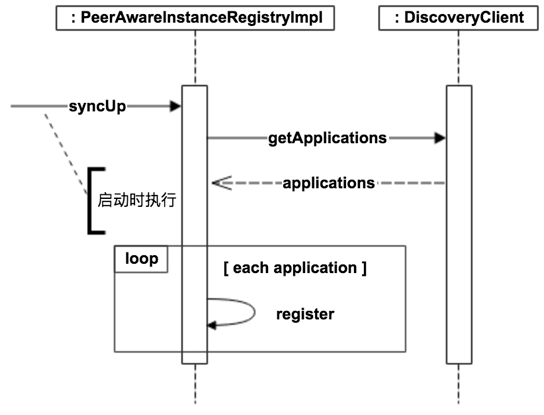

### 2.9 peer节点的自我保护机制：self-preservation mode
server一端有自我保护机制，会在心跳总量无法维持到某一个阈值时触发，触发的结果就是evict过期instance的任务不再驱逐任何实例。
这个阈值的单位是分钟，计算方式是当前所有保存的instance，按照每分钟应该提交2次心跳（30秒心跳），再乘以可以配置的最低能容纳的半分比，而得来

In the case of network outages between peers, following things may happen

- The heartbeat replications between peers may fail and the server detects this situation and enters into a self-preservation mode protecting the current state.
- Registrations may happen in an orphaned server and some clients may reflect new registrations while the others may not.
- The situation autocorrects itself after the network connectivity is restored to a stable state. When the peers are able to communicate fine, the registration information is automatically transferred to the servers that do not have them.
The bottom line is, during the network outages, the server tries to be as resilient as possible, but there is a possibility of clients having different views of the servers during that time

#### 2.2. REST FULL接口
https://github.com/Netflix/eureka/wiki/Eureka-REST-operations
<table>
	<tbody><tr>
		<td> <strong>Operation</strong> </td>
		<td> <strong><span>HTTP</span> action</strong> </td>
		<td> <strong>Description</strong> </td>
	</tr>
	<tr>
		<td> Register new application instance </td>
		<td> <span>POST</span> /eureka/v2/apps/<b>appID</b> </td>
		<td> Input: <span>JSON</span>/<span>XML</span> payload <span>HTTP</span> Code: 204 on success </td>
	</tr>
	<tr>
		<td> De-register application instance </td>
		<td> <span>DELETE</span> /eureka/v2/apps/<b>appID</b>/<b>instanceID</b> </td>
		<td> <span>HTTP</span> Code: 200 on success </td>
	</tr>
	<tr>
		<td> Send application instance heartbeat </td>
		<td> <span>PUT</span> /eureka/v2/apps/<b>appID</b>/<b>instanceID</b> </td>
		<td> <span>HTTP</span> Code:<br>
* 200 on success<br>
* 404 if <b>instanceID</b> doesn’t exist </td>
	</tr>
	<tr>
		<td> Query for all instances </td>
		<td> <span>GET</span> /eureka/v2/apps </td>
		<td> <span>HTTP</span> Code: 200 on success Output: <span>JSON</span>/<span>XML</span>
</td>
	</tr>
	<tr>
		<td> Query for all <b>appID</b> instances </td>
		<td> <span>GET</span> /eureka/v2/apps/<b>appID</b> </td>
		<td> <span>HTTP</span> Code: 200 on success Output: <span>JSON</span>/<span>XML</span> </td>
	</tr>
	<tr>
		<td> Query for a specific <b>appID</b>/<b>instanceID</b> </td>
		<td> <span>GET</span> /eureka/v2/apps/<b>appID</b>/<b>instanceID</b> </td>
		<td> <span>HTTP</span> Code: 200 on success Output: <span>JSON</span>/<span>XML</span>
</td>
	</tr>
	<tr>
		<td> Query for a specific <b>instanceID</b> </td>
		<td> <span>GET</span> /eureka/v2/instances/<b>instanceID</b> </td>
		<td> <span>HTTP</span> Code: 200 on success Output: <span>JSON</span>/<span>XML</span>
</td>
	</tr>
	<tr>
		<td> Take instance out of service </td>
		<td> <span>PUT</span> /eureka/v2/apps/<b>appID</b>/<b>instanceID</b>/status?value=OUT_OF_SERVICE</td>
		<td> <span>HTTP</span> Code:<br>
* 200 on success<br>
* 500 on failure </td>
	</tr>
	<tr>
		<td> Put instance back into service (remove override) </td>
		<td> <span>DELETE</span> /eureka/v2/apps/<b>appID</b>/<b>instanceID</b>/status?value=UP  (The value=UP is optional, it is used as a suggestion for the fallback status due to removal of the override)</td>
		<td> <span>HTTP</span> Code:<br>
* 200 on success<br>
* 500 on failure </td>
	</tr>
	<tr>
		<td> Update metadata </td>
		<td> <span>PUT</span> /eureka/v2/apps/<b>appID</b>/<b>instanceID</b>/metadata?key=value</td>
		<td> <span>HTTP</span> Code:<br>
* 200 on success<br>
* 500 on failure </td>
	</tr>
	<tr>
		<td> Query for all instances under a particular <b>vip address</b> </td>
		<td> <span>GET</span> /eureka/v2/vips/<b>vipAddress</b> </td>
		<td> <br>
* <span>HTTP</span> Code: 200 on success Output: <span>JSON</span>/<span>XML</span> <br>
* 404 if the <b>vipAddress</b> does not exist.</td>
	</tr>
	<tr>
		<td> Query for all instances under a particular <b>secure vip address</b> </td>
		<td> <span>GET</span> /eureka/v2/svips/<b>svipAddress</b> </td>
		<td> <br>
* <span>HTTP</span> Code: 200 on success Output: <span>JSON</span>/<span>XML</span> <br>
* 404 if the <b>svipAddress</b> does not exist.</td>
	</tr>
</tbody>
</table>

## 3.Spring Cloud Eureka

https://segmentfault.com/a/1190000008378268

## 4.常用服务治理工具比较
Eureka,Zookeeper,Consol
http://www.tuicool.com/articles/zyy2qeZ

<table>
    <thead>
      <tr>
        <th width="26%">Feature</th>
        <th width="21%">Consul</th>
        <th width="17%">zookeeper</th>
        <th width="18%">etcd</th>
        <th width="18%">euerka</th>
      </tr>
    </thead>
    <tbody>
      <tr>
        <td>服务健康检查</td>
        <td>服务状态，内存，硬盘等</td>
        <td>(弱)长连接，keepalive</td>
        <td>连接心跳</td>
        <td>可配支持</td>
      </tr>
      <tr>
        <td>多数据中心</td>
        <td>支持</td>
        <td>—</td>
        <td>—</td>
        <td>—</td>
      </tr>
      <tr>
        <td>kv存储服务</td>
        <td>支持</td>
        <td>支持</td>
        <td>支持</td>
        <td>—</td>
      </tr>
      <tr>
        <td>一致性</td>
        <td>raft</td>
        <td>paxos</td>
        <td>raft</td>
        <td>—</td>
      </tr>
      <tr>
        <td>cap</td>
        <td>ca</td>
        <td>cp</td>
        <td>cp</td>
        <td>ap</td>
      </tr>
      <tr>
        <td>使用接口(多语言能力)</td>
        <td>支持http和dns</td>
        <td>客户端</td>
        <td>http/grpc</td>
        <td>http（sidecar）</td>
      </tr>
      <tr>
        <td>watch支持</td>
        <td>全量/支持long polling</td>
        <td>支持</td>
        <td>支持 long polling</td>
        <td>支持 long polling/大部分增量</td>
      </tr>
      <tr>
        <td>自身监控</td>
        <td>metrics</td>
        <td>—</td>
        <td>metrics</td>
        <td>metrics</td>
      </tr>
      <tr>
        <td>安全</td>
        <td>acl /https</td>
        <td>acl</td>
        <td>https支持（弱）</td>
        <td>—</td>
      </tr>
      <tr>
        <td>spring cloud集成</td>
        <td>已支持</td>
        <td>已支持</td>
        <td>已支持</td>
        <td>已支持</td>
      </tr>
    </tbody>
  </table>

1. `服务的健康检查`：
Euraka 使用时需要显式配置健康检查支持；Zookeeper,Etcd 则在失去了和服务进程的连接情况下任务不健康，而 Consul 相对更为详细点，比如内存是否已使用了90%，文件系统的空间是不是快不足了。

1. `多数据中心支持`：
Consul 通过 WAN 的 Gossip 协议，完成跨数据中心的同步；而且其他的产品则需要额外的开发工作来实现；

1. `KV 存储服务`：
除了 Eureka ,其他几款都能够对外支持 k-v 的存储服务，所以后面会讲到这几款产品追求高一致性的重要原因。而提供存储服务，也能够较好的转化为动态配置服务哦。

1. `产品设计中 CAP 理论的取舍`：
Eureka 典型的 AP,作为分布式场景下的服务发现的产品较为合适，服务发现场景的可用性优先级较高，一致性并不是特别致命。其次 CA 类型的场景 Consul,也能提供较高的可用性，并能 k-v store 服务保证一致性。 而Zookeeper,Etcd则是CP类型 牺牲可用性，在服务发现场景并没太大优势；

1. `多语言能力与对外提供服务的接入协议`：
Zookeeper的跨语言支持较弱，其他几款支持 http11 提供接入的可能。Euraka 一般通过 sidecar的方式提供多语言客户端的接入支持。Etcd 还提供了Grpc的支持。 Consul除了标准的Rest服务api,还提供了DNS的支持。

1. `Watch的支持（客户端观察到服务提供者变化）`：
Zookeeper 支持服务器端推送变化，Eureka 2.0(正在开发中)也计划支持。 Eureka 1,Consul,Etcd则都通过长轮询的方式来实现变化的感知；

1. `自身集群的监控`：
除了 Zookeeper ,其他几款都默认支持 metrics，运维者可以搜集并报警这些度量信息达到监控目的；

1. `安全`：
Consul,Zookeeper 支持ACL，另外 Consul,Etcd 支持安全通道https.

1. `Spring Cloud的集成`：
目前都有相对应的 boot starter，提供了集成能力。

总的来看，目前Consul 自身功能，和 spring cloud 对其集成的支持都相对较为完善，而且运维的复杂度较为简单（没有详细列出讨论），Eureka 设计上比较符合场景，但还需持续的完善
## 5.最佳实践
参数配置的最佳实践：
https://github.com/spring-cloud/spring-cloud-netflix/issues/203

多网卡环境下Eureka服务注册IP选择问题
http://blog.csdn.net/neosmith/article/details/53126924

**如何解决Eureka Server不踢出已关停的节点的问题**

在开发过程中，我们常常希望Eureka Server能够迅速有效地踢出已关停的节点，但是新手由于Eureka自我保护模式，以及心跳周期长的原因，常常会遇到Eureka Server不踢出已关停的节点的问题。解决方法如下：

(1) Eureka Server端：配置关闭自我保护，并按需配置Eureka Server清理无效节点的时间间隔

```java
eureka.server.enable-self-preservation			# 设为false，关闭自我保护
eureka.server.eviction-interval-timer-in-ms     # 清理间隔（单位毫秒，默认是60*1000）
```

(2) Eureka Client端：配置开启健康检查，并按需配置续约更新时间和到期时间

```java
eureka.client.healthcheck.enabled			# 开启健康检查（需要spring-boot-starter-actuator依赖）
eureka.instance.lease-renewal-interval-in-seconds		# 续约更新时间间隔（默认30秒）
eureka.instance.lease-expiration-duration-in-seconds 	# 续约到期时间（默认90秒）
```